# High-Level Design: Sarathi AI — AI-Powered Delivery Governance and KPI Dashboard

**Version:** 1.0  
**Status:** Draft  
**Prepared For:** Digital Engineering Internship Program 2026 — Group 10  
**Organization:** Techwave Consulting India Pvt. Ltd.  
**Date:** July 2026

---

## Table of Contents

1. [System Overview & Context](#1-system-overview--context)
2. [Architecture Design](#2-architecture-design)
3. [Component Diagram](#3-component-diagram)
4. [Component Interactions](#4-component-interactions)
5. [Data Design & Data Flow](#5-data-design--data-flow)
6. [Technology Stack](#6-technology-stack)
7. [External Integrations](#7-external-integrations)
8. [Deployment Architecture](#8-deployment-architecture)
9. [Security Architecture](#9-security-architecture)
10. [Non-Functional Requirements](#10-non-functional-requirements)
11. [Major Workflow Sequences](#11-major-workflow-sequences)

---

## 1. System Overview & Context

### 1.1 Overview

Sarathi AI is an **AI-Powered Delivery Governance and KPI Dashboard** that provides
centralized, real-time visibility into software delivery performance across projects managed
in Azure DevOps. The platform integrates Azure DevOps REST APIs to collect project,
sprint, work-item, repository, and pipeline data, then processes that data through a
KPI Engine, a Sprint Governance module, an AI Risk Analysis Engine (powered by
Azure OpenAI), and an AI Executive Reporting module. Role-based dashboards present
all insights to Administrators, Project Managers, and IT Admins through an interactive
React.js frontend backed by an ASP.NET Core API.

### 1.2 Business Problem

Organizations managing software delivery through Agile and Azure DevOps generate
large volumes of operational data but struggle to:
- Consolidate delivery metrics from fragmented dashboards.
- Calculate and monitor governance KPIs without manual effort.
- Identify delivery risks, sprint anomalies, and productivity bottlenecks proactively.
- Generate executive-grade reports automatically.

### 1.3 Business Objectives (from BRD)

| ID    | Objective |
|-------|-----------|
| BO-01 | Centralized delivery governance platform integrated with Azure DevOps |
| BO-02 | Automate KPI collection, monitoring, and reporting |
| BO-03 | Real-time visibility into sprint execution and project performance |
| BO-04 | Measure quality, productivity, and delivery metrics |
| BO-05 | Detect project risks using AI-powered analysis |
| BO-06 | Generate automated executive reports and delivery summaries |
| BO-07 | Enable data-driven decision-making through predictive analytics |
| BO-08 | Reduce governance overhead and manual reporting effort |
| BO-09 | Provide secure role-based access through Microsoft Entra ID |
| BO-10 | Deliver a scalable and intelligent governance platform |

### 1.4 Scope

**In Scope:**
- Azure DevOps integration via REST APIs (projects, work items, sprints, repos, pipelines)
- SQLite data persistence (replacing Azure SQL Database)
- Delivery KPI calculation and monitoring engine
- Sprint governance and delivery tracking module
- AI risk analysis and predictive insights (Azure OpenAI)
- AI-generated executive summaries and governance reports
- Role-based dashboards (React.js)
- Microsoft Entra ID authentication (OAuth 2.0 / OpenID Connect)
- Audit logging and synchronization monitoring

**Out of Scope (MVP):**
- Project budgeting and financial management
- Mobile application
- Jira, GitHub, ServiceNow integrations
- Employee performance appraisal

### 1.5 User Roles

| Role | Access |
|------|--------|
| Administrator | Organization-wide access to all projects, dashboards, AI insights, and governance controls |
| Project Manager | Access limited to assigned projects; views KPIs, sprint data, risks, and reports |
| IT Admin | Platform configuration, user management, sync monitoring, audit log access |

### 1.6 System Context Diagram

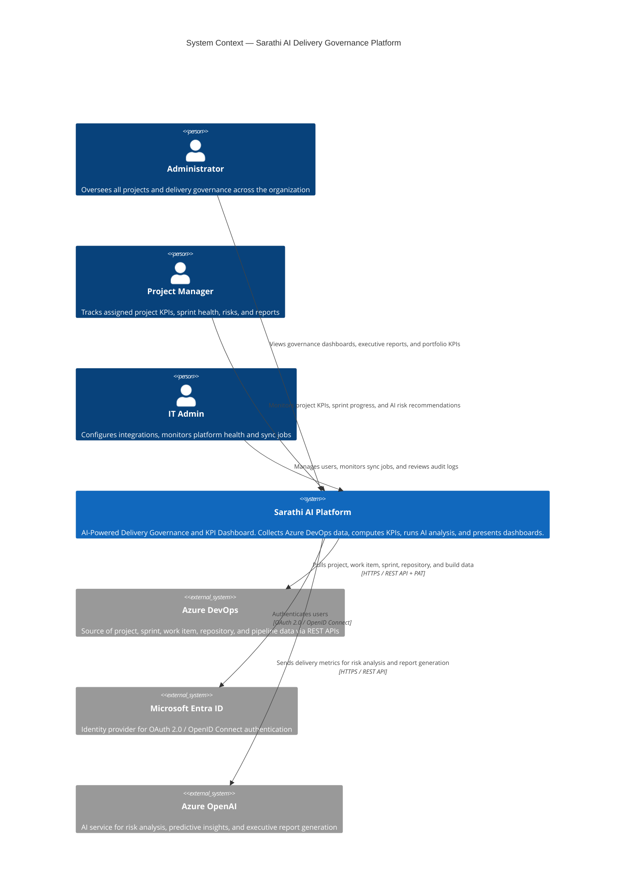

---

---

## 2. Architecture Design

### 2.1 Architectural Style

Sarathi AI follows a **Layered Clean Architecture** with clear separation between
Presentation, Application, Domain, and Infrastructure concerns. The backend exposes a
**RESTful API** surface, and the frontend is a **Single-Page Application (SPA)**. All
cross-cutting concerns (auth, logging, error handling) are handled via middleware.

```
┌──────────────────────────────────────────────┐
│              Presentation Layer               │
│  React.js SPA (TypeScript)                   │
│  Role-based dashboards · Charts · Reports    │
└─────────────────────┬────────────────────────┘
                      │ HTTPS / REST JSON
┌─────────────────────▼────────────────────────┐
│               API Gateway Layer               │
│  ASP.NET Core Web API                        │
│  Auth Middleware · RBAC · Rate Limiting      │
└─────────────────────┬────────────────────────┘
                      │
        ┌─────────────┼──────────────┐
        │             │              │
┌───────▼──────┐ ┌────▼──────┐ ┌────▼───────────┐
│  Application │ │  Domain   │ │ Infrastructure  │
│  Services    │ │  Models   │ │  Layer          │
│  KPI Engine  │ │  Entities │ │  Repositories   │
│  AI Engine   │ │  Business │ │  SQLite (EF)    │
│  Sync Engine │ │  Rules    │ │  Azure DevOps   │
│  Report Svc  │ │           │ │  Azure OpenAI   │
└──────────────┘ └───────────┘ └────────────────┘
```

### 2.2 Architectural Layers

| Layer | Technology | Responsibility |
|-------|-----------|----------------|
| **Presentation** | React.js + TypeScript | Role-based dashboards, charts, KPI cards, report viewer |
| **API Gateway** | ASP.NET Core Web API | REST endpoints, JWT validation, RBAC enforcement, request routing |
| **Application** | C# Service classes | Use-case orchestration — KPI Engine, Sync Engine, AI Engine, Report Service |
| **Domain** | C# Domain models | Business rules (BR-01 to BR-14), entities, value objects |
| **Infrastructure** | EF Core + SQLite, HttpClient | Data persistence, Azure DevOps REST client, Azure OpenAI REST client |
| **Background Services** | ASP.NET Core Hosted Services | Scheduled sync jobs, KPI calculation triggers, AI report generation |

### 2.3 Container View

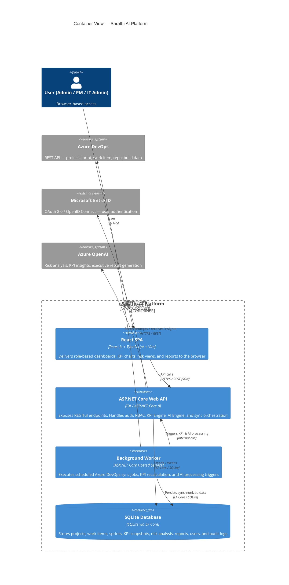

### 2.4 Key Architectural Decisions

| Decision | Choice | Rationale |
|----------|--------|-----------|
| Backend framework | ASP.NET Core 8 Web API | Specified in BRD tech stack; strong support for clean architecture, dependency injection, hosted services |
| Frontend framework | React.js + TypeScript | Specified in BRD; component-based, type-safe, supports rich dashboard UIs |
| Database | SQLite via EF Core | Constraint: replaces Azure SQL Database; lightweight, file-based, zero-config for internship MVP |
| Authentication | Microsoft Entra ID (OAuth 2.0 / OIDC) | Specified in BRD; centralized identity, JWT-based, supports RBAC |
| AI service | Azure OpenAI | Specified in BRD; used for risk analysis, KPI insights, and executive report generation |
| API Integration | Azure DevOps REST API + PAT | Specified in BRD FR-1.1, FR-1.2; standard approach for ADO data retrieval |
| Sync mechanism | ASP.NET Core Background Hosted Service | Supports scheduled + manual sync (FR-1.7); retry on failure (NFR-12) |
| Architecture pattern | Clean Architecture + SOLID | Decouples domain logic from infrastructure; testable, maintainable layers |

---

---

## 3. Component Diagram

### 3.1 Backend Components

```mermaid
graph TD
  subgraph "ASP.NET Core Web API"
    AC[AuthController] --> AM[Auth Middleware]
    AM --> RBAC[RBAC Policy Handler]

    PC[ProjectsController] --> PS[ProjectService]
    SC[SprintsController] --> SS[SprintService]
    WC[WorkItemsController] --> WS[WorkItemService]
    KC[KPIController] --> KPI[KPI Engine]
    RC[RiskController] --> AIR[AI Risk Engine]
    EC[ReportsController] --> AER[AI Report Engine]
    SNC[SyncController] --> SYNC[Sync Orchestrator]
    ALC[AuditController] --> ALS[AuditLogService]
  end

  subgraph "Application Services"
    PS --> PR[ProjectRepository]
    SS --> SR[SprintRepository]
    WS --> WR[WorkItemRepository]
    KPI --> KR[KPISnapshotRepository]
    AIR --> RAR[RiskAnalysisRepository]
    AER --> ERR[ExecutiveReportRepository]
    SYNC --> ADO[AzureDevOpsClient]
    SYNC --> PR
    SYNC --> SR
    SYNC --> WR
    SYNC --> SLR[SyncLogRepository]
    ALS --> ALREP[AuditLogRepository]
  end

  subgraph "Infrastructure"
    PR --> DB[(SQLite via EF Core)]
    SR --> DB
    WR --> DB
    KR --> DB
    RAR --> DB
    ERR --> DB
    SLR --> DB
    ALREP --> DB
    ADO --> AzDev[Azure DevOps REST API]
    AIR --> OAIC[OpenAIClient]
    AER --> OAIC
    OAIC --> AzOAI[Azure OpenAI]
  end

  subgraph "Background Worker"
    BW[SyncHostedService] --> SYNC
    BW --> KPI
    BW --> AIR
  end
```

### 3.2 Frontend Components

```mermaid
graph TD
  subgraph "React SPA"
    App[App.tsx] --> Router[React Router]
    Router --> AuthGuard[AuthGuard / RBAC Guard]

    AuthGuard --> Dashboard[Dashboard Page]
    AuthGuard --> Projects[Projects Page]
    AuthGuard --> SprintView[Sprint Governance Page]
    AuthGuard --> KPIView[KPI Dashboard Page]
    AuthGuard --> RiskView[Risk Analysis Page]
    AuthGuard --> Reports[Executive Reports Page]
    AuthGuard --> Admin[Admin Panel Page]

    Dashboard --> KPICard[KPICard Component]
    Dashboard --> RiskBadge[RiskBadge Component]
    Dashboard --> TrendChart[TrendChart Component]

    SprintView --> BurndownChart[BurndownChart]
    SprintView --> WorkItemTable[WorkItemTable]

    KPIView --> VelocityChart[VelocityChart]
    KPIView --> DefectChart[DefectDensityChart]
    KPIView --> BacklogGauge[BacklogHealthGauge]

    RiskView --> RiskScoreCard[RiskScoreCard]
    RiskView --> AIInsightPanel[AIInsightPanel]
    RiskView --> RecommendationList[RecommendationList]

    Reports --> ReportViewer[ReportViewer]
    Reports --> DownloadButton[DownloadButton]

    Admin --> SyncStatus[SyncStatusPanel]
    Admin --> UserTable[UserTable]
    Admin --> AuditLogTable[AuditLogTable]
  end

  subgraph "Shared"
    APIClient[API Client (Axios)]
    AuthContext[AuthContext / Entra MSAL]
    RoleContext[RoleContext]
    Dashboard --> APIClient
    Projects --> APIClient
    SprintView --> APIClient
    KPIView --> APIClient
    RiskView --> APIClient
    Reports --> APIClient
    Admin --> APIClient
    App --> AuthContext
    App --> RoleContext
  end
```

### 3.3 Component Registry

| Component | Layer | Epic | Responsibility |
|-----------|-------|------|----------------|
| `SyncHostedService` | Background Worker | Epic 1 | Schedules and triggers Azure DevOps sync jobs |
| `AzureDevOpsClient` | Infrastructure | Epic 1 | HTTP client for Azure DevOps REST API calls |
| `SyncOrchestrator` | Application | Epic 1 | Coordinates sync of projects, work items, sprints, repos, builds, releases |
| `AuthMiddleware` | API | Epic 2 | Validates JWT tokens issued by Microsoft Entra ID |
| `RBACPolicyHandler` | API | Epic 2 | Enforces role-based permissions per endpoint |
| `AuditLogService` | Application | Epic 2 | Records user login, logout, and admin activities |
| `KPIEngine` | Application | Epic 3 | Calculates sprint velocity, completion rate, defect density, backlog health, release success rate |
| `SprintService` | Application | Epic 4 | Tracks sprint progress, burndown, delayed work items, and sprint health |
| `AIRiskEngine` | Application | Epic 5 | Sends KPI + sprint data to Azure OpenAI; parses risk scores, factors, and recommendations |
| `AIReportEngine` | Application | Epic 6 | Generates executive summaries, portfolio reports, and sprint review summaries via Azure OpenAI |
| `OpenAIClient` | Infrastructure | Epic 5–6 | HTTP client for Azure OpenAI REST API; manages prompt construction and response parsing |
| `DashboardPage` | Frontend | Epic 7 | Role-filtered entry point rendering KPI cards, risk badges, and trend charts |
| `AdminPanel` | Frontend | Epic 2, 1 | Sync status, user management, audit log viewer |

---

---

## 4. Component Interactions

### 4.1 Azure DevOps Sync Interaction

Describes how the Background Worker syncs Azure DevOps data into SQLite.

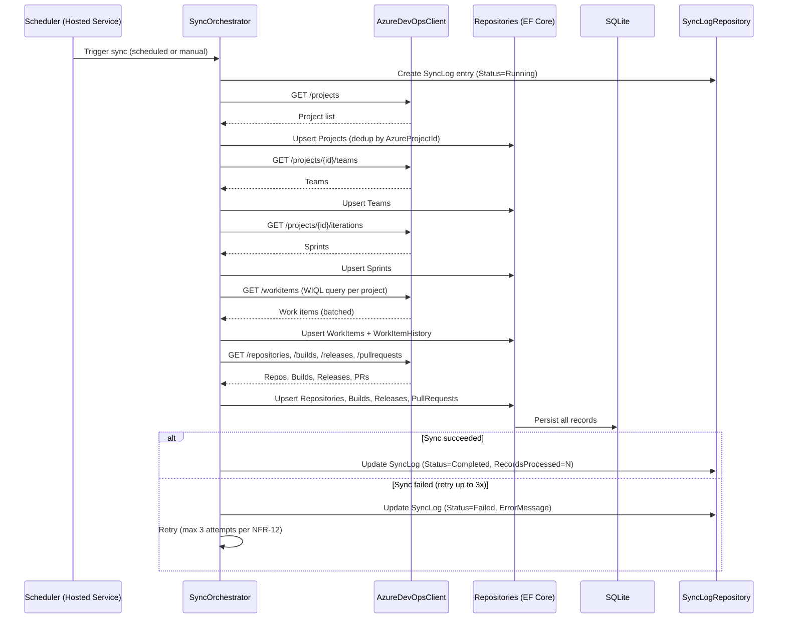

### 4.2 KPI Calculation Interaction

Describes how the KPI Engine computes and stores delivery metrics after sync.

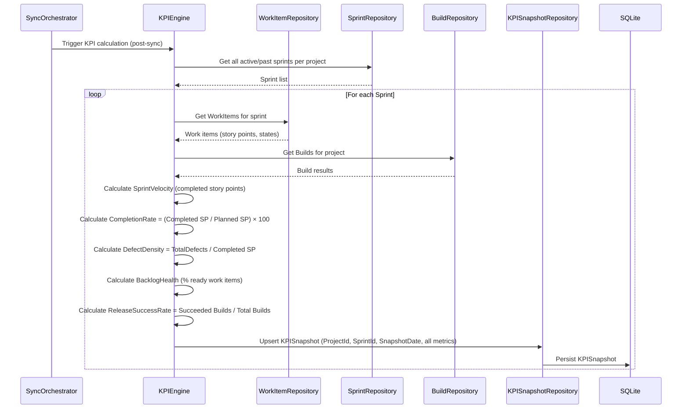

### 4.3 AI Risk Analysis Interaction

Describes how the AI Risk Engine sends KPI data to Azure OpenAI and stores the result.

```mermaid
sequenceDiagram
  participant TRIGGER as KPIEngine (post-calc) or Manual API call
  participant AIR as AIRiskEngine
  participant KR as KPISnapshotRepository
  participant OAIC as OpenAIClient
  participant AzOAI as Azure OpenAI
  participant RAR as RiskAnalysisRepository
  participant AR as AIRecommendationRepository
  participant DB as SQLite

  TRIGGER->>AIR: Analyze risk for Project+Sprint
  AIR->>KR: Fetch latest KPISnapshot
  KR-->>AIR: KPI data (velocity, completion rate, defect density, etc.)
  AIR->>AIR: Build structured prompt (KPI data + governance context)
  AIR->>OAIC: POST /chat/completions (prompt)
  OAIC->>AzOAI: Forward request
  AzOAI-->>OAIC: Risk score, level, summary, factors, recommendations
  OAIC-->>AIR: Parsed AI response
  AIR->>AIR: Classify RiskLevel (0-30 Low, 31-60 Medium, 61-80 High, 81-100 Critical)
  AIR->>RAR: Insert RiskAnalysis (Score, Level, Summary, GeneratedDate)
  RAR->>DB: Persist
  loop For each Risk Factor
    AIR->>RAR: Insert RiskFactor (FactorName, FactorValue, Description)
  end
  loop For each Recommendation
    AIR->>AR: Insert AIRecommendation (Recommendation, Priority)
    AR->>DB: Persist
  end
  alt AI call fails
    AIR->>AIR: Log failure; retry if applicable (NFR-13)
    AIR->>AIR: Dashboard remains available (NFR-30)
  end
```

### 4.4 Dashboard Data Fetch Interaction

Describes how the React SPA fetches role-filtered data for the dashboard.

```mermaid
sequenceDiagram
  participant USER as User (Browser)
  participant SPA as React SPA
  participant MSAL as MSAL (Entra ID)
  participant API as ASP.NET Core API
  participant AUTH as AuthMiddleware
  participant RBAC as RBACPolicyHandler
  participant SVC as ProjectService / KPIEngine
  participant DB as SQLite

  USER->>SPA: Navigate to Dashboard
  SPA->>MSAL: Acquire access token (silent or interactive)
  MSAL-->>SPA: JWT access token
  SPA->>API: GET /api/dashboard (Authorization: Bearer <token>)
  API->>AUTH: Validate JWT signature and expiry
  AUTH->>RBAC: Check role claim vs endpoint policy
  alt Unauthorized
    RBAC-->>SPA: 401 / 403
  else Authorized
    RBAC->>SVC: Get projects for user role
    note over SVC: Admin → all projects; PM → assigned projects only (BR-07)
    SVC->>DB: Query Projects, KPISnapshots, RiskAnalysis
    DB-->>SVC: Filtered data
    SVC-->>API: Aggregated dashboard DTO
    API-->>SPA: 200 OK JSON response
    SPA->>SPA: Render KPI cards, risk badges, trend charts
  end
```

### 4.5 Executive Report Generation Interaction

```mermaid
sequenceDiagram
  participant USER as Admin / PM
  participant SPA as React SPA
  participant API as ASP.NET Core API
  participant AER as AIReportEngine
  participant KR as KPISnapshotRepository
  participant RAR as RiskAnalysisRepository
  participant OAIC as OpenAIClient
  participant AzOAI as Azure OpenAI
  participant ERR as ExecutiveReportRepository
  participant DB as SQLite

  USER->>SPA: Request Executive Report (Project + Period)
  SPA->>API: POST /api/reports/generate
  API->>AER: GenerateReport(projectId, period)
  AER->>KR: Fetch KPI history for period
  AER->>RAR: Fetch risk analysis records
  KR-->>AER: KPI snapshots
  RAR-->>AER: Risk records + recommendations
  AER->>AER: Build executive prompt (project health, KPIs, risks, recommendations)
  AER->>OAIC: POST /chat/completions
  OAIC->>AzOAI: Forward prompt
  AzOAI-->>OAIC: Executive summary text
  OAIC-->>AER: Summary
  AER->>ERR: Insert ExecutiveReport (Title, Summary, GeneratedDate, GeneratedBy)
  ERR->>DB: Persist
  AER-->>API: Report DTO
  API-->>SPA: 200 OK (report content + download link)
  SPA->>USER: Display report; enable PDF download
```

---

---

## 5. Data Design & Data Flow

### 5.1 Entity Relationship Overview

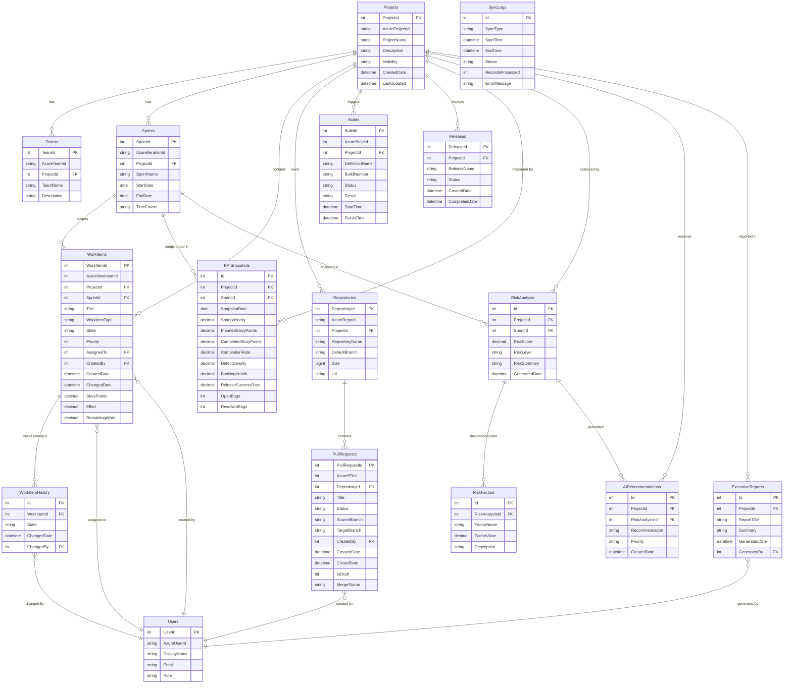

### 5.2 Data Flow Diagram

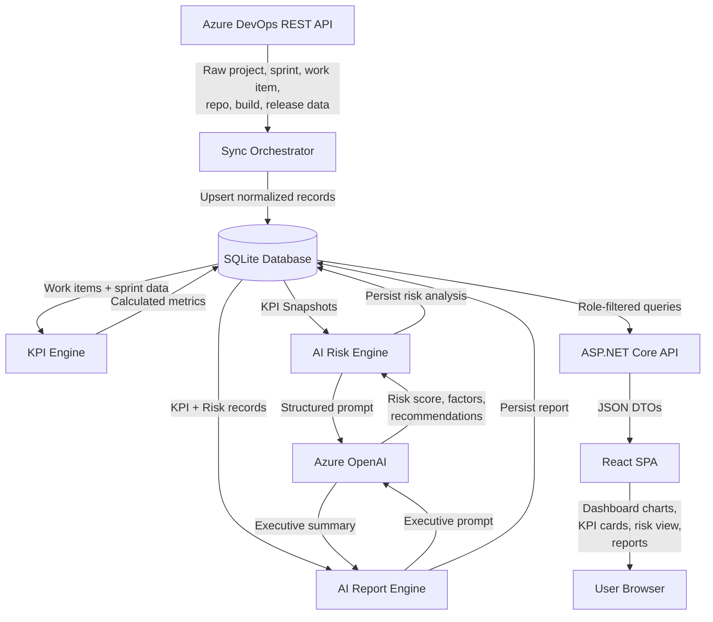

### 5.3 Data Retention Policy (from BRD)

| Data Type | Retention Period | Rule |
|-----------|-----------------|------|
| KPI historical data | 24 months minimum | BR-11 / NFR-24 |
| Audit logs | 90 days minimum | BR-10 / NFR-25 |
| Synchronization logs | 12 months | BR-12 |
| Database backups | Daily, encrypted | NFR-26, NFR-27 |

### 5.4 Data Integrity Rules

| Rule | Implementation |
|------|---------------|
| No duplicate projects on sync | Upsert by `AzureProjectId` |
| No duplicate work items | Upsert by `AzureWorkItemId` |
| No duplicate sprints | Upsert by `AzureIterationId` |
| Work item history append-only | Insert new row on each state change (never update) |
| KPI snapshot per sprint per day | Unique constraint on `(ProjectId, SprintId, SnapshotDate)` |
| Risk analysis traceable to KPI data | `RiskAnalysis.SprintId` links to source `KPISnapshot` |
| AI recommendations traceable | `AIRecommendations.RiskAnalysisId` FK maintained |

---

---

## 6. Technology Stack

### 6.1 Full Stack Overview

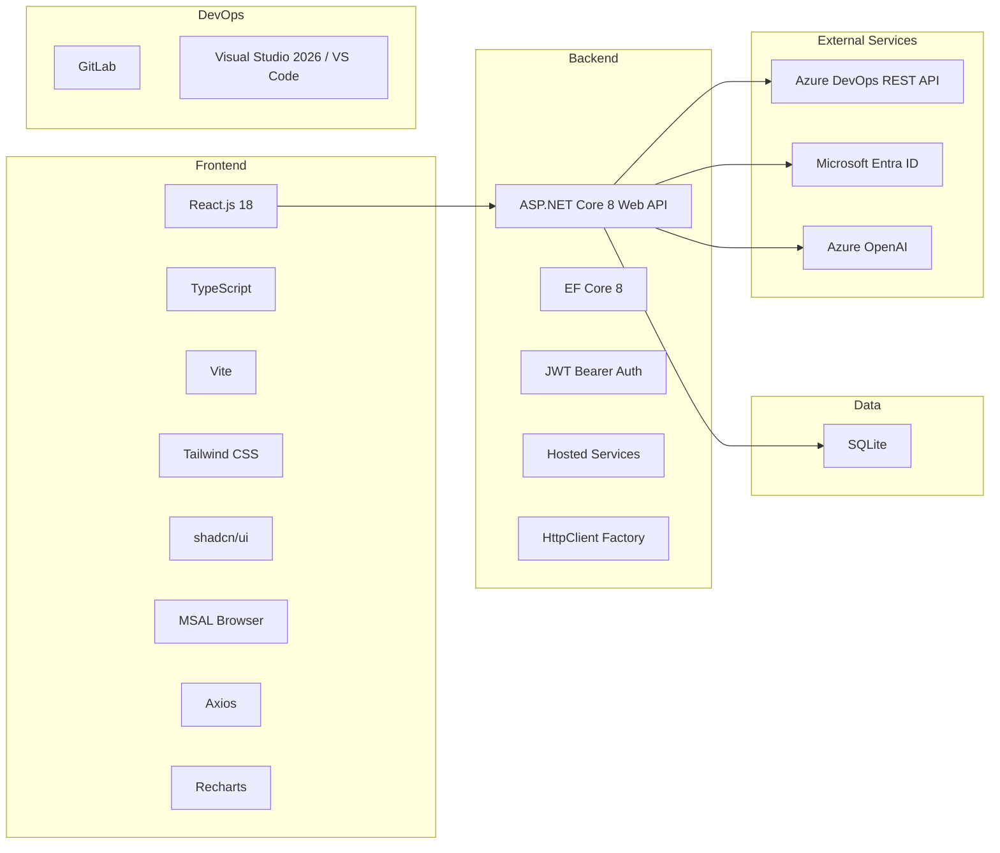

### 6.2 Technology Stack Table

| Category | Technology | Version | Purpose | Justification (BRD §9) |
|----------|-----------|---------|---------|------------------------|
| **Frontend Framework** | React.js | 18.x | SPA, component-based UI | BRD specified |
| **Frontend Language** | TypeScript | 5.x | Type-safe frontend development | BRD specified |
| **Frontend Build Tool** | Vite | 5.x | Fast dev server and production bundler | Workspace already configured |
| **UI Component Library** | shadcn/ui + Tailwind CSS | Latest | Consistent design system, dashboard widgets | Workspace already scaffolded |
| **Charts / Visualization** | Recharts | 2.x | KPI trend charts, burndown, velocity, defect charts | Open-source, React-native charting |
| **Auth Client (Frontend)** | MSAL Browser (@azure/msal-browser) | 3.x | Entra ID OAuth 2.0 / OIDC token acquisition | Required for Entra ID integration |
| **HTTP Client (Frontend)** | Axios | 1.x | REST API calls from SPA to backend | Standard, interceptor support for JWT |
| **Backend Framework** | ASP.NET Core 8 Web API | 8.x | RESTful API, DI container, middleware pipeline | BRD specified |
| **Backend Language** | C# | 12 | Business logic, KPI engine, AI engine | BRD specified |
| **ORM** | Entity Framework Core | 8.x | Database access, migrations, LINQ queries | Standard .NET ORM for SQLite |
| **Database** | SQLite | 3.x | Lightweight relational data store | Replaces Azure SQL Database per project constraint |
| **Authentication** | Microsoft Entra ID | — | OAuth 2.0 / OpenID Connect identity provider | BRD specified (NFR-06) |
| **JWT Validation** | Microsoft.Identity.Web | 3.x | Validates Entra ID JWT tokens in ASP.NET Core | Standard library for Entra ID integration |
| **AI Service** | Azure OpenAI | GPT-4o | Risk analysis, KPI insights, executive reports | BRD specified (Epic 5, Epic 6) |
| **API Integration** | Azure DevOps REST API v7 | 7.x | Project, sprint, work item, repo, build data | BRD specified (FR-1.1, FR-1.2) |
| **Background Jobs** | ASP.NET Core Hosted Services | Built-in | Scheduled sync, KPI recalc, AI triggers | Supports NFR-12 retry logic |
| **Version Control** | Git + GitLab | — | Source code management, CI/CD | BRD specified |
| **IDE** | Visual Studio 2026 / VS Code | — | Development environment | BRD specified |
| **Documentation** | Markdown (this document) | — | Architecture and design artifacts | Project standard |

### 6.3 Key Library Decisions

| Decision | Chosen Library | Reason |
|----------|---------------|--------|
| SQLite provider for EF Core | `Microsoft.EntityFrameworkCore.Sqlite` | Official EF Core SQLite driver; no separate server needed |
| Azure OpenAI client | `Azure.AI.OpenAI` NuGet | Official Azure SDK; typed prompt/response models |
| Azure DevOps client | `Microsoft.TeamFoundationServer.Client` or raw `HttpClient` | Covers REST API v7; HttpClient preferred for lightweight control |
| Entra ID backend auth | `Microsoft.Identity.Web` + `Microsoft.Identity.Web.UI` | Standard library; handles token validation and RBAC claims |
| Entra ID frontend auth | `@azure/msal-browser` + `@azure/msal-react` | Official Microsoft library for SPA OAuth 2.0 flows |
| Logging | `Microsoft.Extensions.Logging` + Serilog | Structured logging to console and file; supports audit trail (NFR-20–23) |

---

---

## 7. External Integrations

### 7.1 Integration Overview

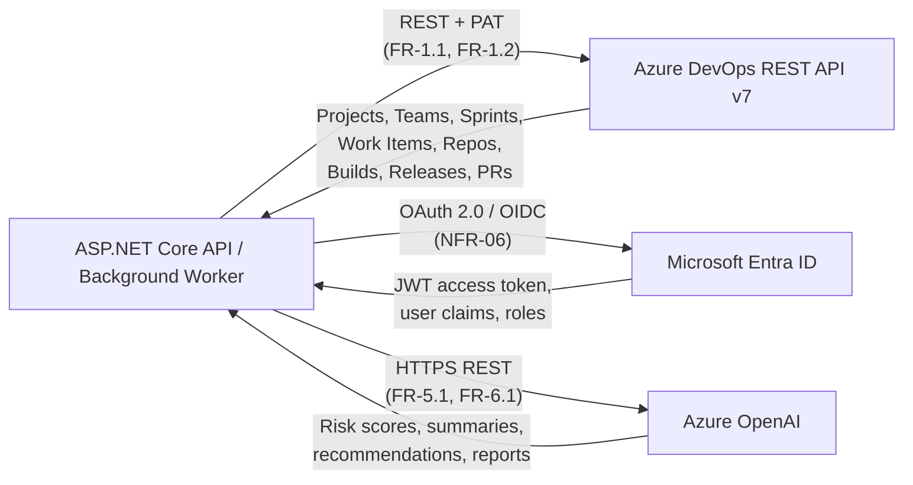

### 7.2 Azure DevOps Integration

| Attribute | Detail |
|-----------|--------|
| **Protocol** | HTTPS REST API v7 |
| **Authentication** | Personal Access Token (PAT) or Service Principal (FR-1.2) |
| **Base URL** | `https://dev.azure.com/{organization}` |
| **Data Retrieved** | Projects, Teams, Sprints (Iterations), Work Items, Repositories, Pull Requests, Builds, Releases |
| **Sync Mode** | Scheduled (background job) + Manual trigger via API endpoint (FR-1.7) |
| **Error Handling** | Failed sync retried up to 3 times; failure logged in `SyncLogs` (NFR-12) |
| **Deduplication** | Upsert by Azure ID fields (`AzureProjectId`, `AzureWorkItemId`, `AzureIterationId`, etc.) |
| **Config** | Organization URL + PAT stored in `appsettings.json` / environment variable (never hardcoded) |

**Key Endpoints Used:**

| Resource | Endpoint |
|----------|----------|
| Projects | `GET /_apis/projects` |
| Teams | `GET /_apis/projects/{id}/teams` |
| Iterations (Sprints) | `GET /{project}/{team}/_apis/work/teamsettings/iterations` |
| Work Items (WIQL) | `POST /{project}/_apis/wit/wiql` + `GET /_apis/wit/workitems?ids=` |
| Work Item Updates | `GET /_apis/wit/workitems/{id}/updates` |
| Repositories | `GET /{project}/_apis/git/repositories` |
| Pull Requests | `GET /{project}/_apis/git/repositories/{repo}/pullrequests` |
| Builds | `GET /{project}/_apis/build/builds` |
| Releases | `GET /{project}/_apis/release/releases` |

### 7.3 Microsoft Entra ID Integration

| Attribute | Detail |
|-----------|--------|
| **Protocol** | OAuth 2.0 Authorization Code Flow with PKCE (SPA) |
| **Token Type** | JWT Bearer (access token + ID token) |
| **Library (Frontend)** | `@azure/msal-browser` + `@azure/msal-react` |
| **Library (Backend)** | `Microsoft.Identity.Web` |
| **Claims Used** | `oid` (user ID), `email`, `roles` (RBAC), `name` (display name) |
| **Role Mapping** | Entra ID App Roles → Administrator, ProjectManager, ITAdmin |
| **Session Expiry** | Access tokens expire per Entra ID policy; sessions expire after 30 min inactivity (NFR-10) |
| **Logout** | SPA calls MSAL `logoutRedirect`; backend invalidates session |
| **Unauthorized Access** | Logged and monitored (NFR-09); returns HTTP 401/403 |

**Auth Flow (PKCE):**

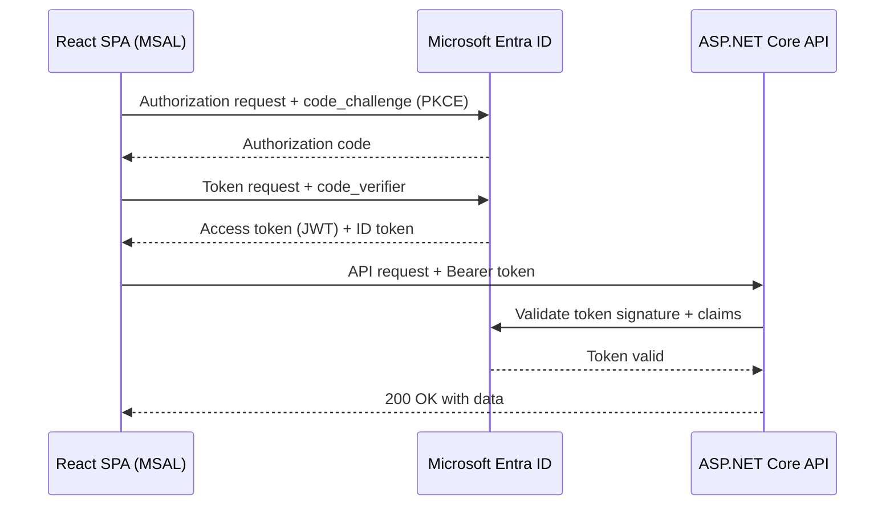

### 7.4 Azure OpenAI Integration

| Attribute | Detail |
|-----------|--------|
| **Protocol** | HTTPS REST API |
| **SDK** | `Azure.AI.OpenAI` NuGet package |
| **Model** | GPT-4o (configurable) |
| **Endpoint** | `https://{resource}.openai.azure.com/openai/deployments/{deployment}/chat/completions` |
| **Use Cases** | Risk analysis (Epic 5), executive report generation (Epic 6) |
| **Prompt Strategy** | Structured system prompt + user prompt with KPI/sprint data in JSON |
| **Response Parsing** | JSON-structured response: risk score, level, factors, recommendations, summary |
| **Failure Handling** | AI failures logged; retried where applicable (NFR-13); dashboard availability unaffected (NFR-30) |
| **Audit** | All AI requests and responses logged for traceability (NFR-33) |
| **Governance** | Responses labeled as AI-generated (NFR-29); traceable to source KPI data (NFR-31) |
| **Config** | API key + endpoint + deployment name stored in environment variables / Azure Key Vault |

**AI Prompt Structure (Risk Analysis):**

```
System: You are a delivery governance analyst. Analyze the following sprint KPI data 
        and return a JSON object with: riskScore (0-100), riskLevel, riskSummary, 
        factors (array of {factorName, factorValue, description}), 
        recommendations (array of {recommendation, priority}).

User:   Project: {name}, Sprint: {name}
        - SprintVelocity: {value}
        - CompletionRate: {value}%
        - DefectDensity: {value}
        - BacklogHealth: {value}%
        - ReleaseSuccessRate: {value}%
        - OpenBugs: {count}
```

---

---

## 8. Deployment Architecture

### 8.1 Deployment Overview

The MVP deployment targets **Azure App Service** for the backend and **Azure Static Web Apps** (or App Service) for the frontend, with a **SQLite file** co-located with the backend process. This aligns with the BRD AI Budget estimate ($20–$55/month) and the internship timeline.

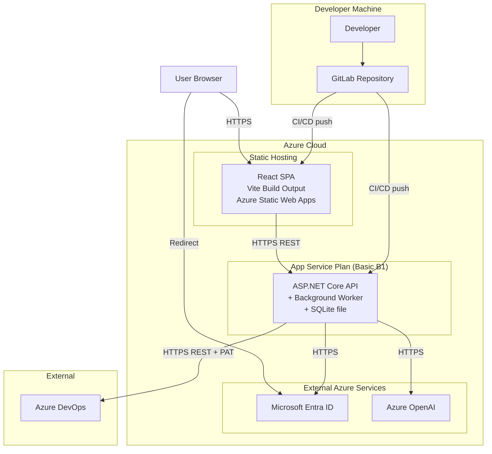

### 8.2 Deployment Units

| Unit | Hosting | Technology | Notes |
|------|---------|-----------|-------|
| **React SPA** | Azure Static Web Apps (Free/Standard tier) | Vite production build (HTML/JS/CSS) | CDN-distributed; env vars injected at build time |
| **ASP.NET Core API** | Azure App Service (Basic B1) | .NET 8 runtime | Hosts Web API + Background Hosted Services in same process |
| **SQLite Database** | Co-located with App Service | SQLite file on App Service persistent storage | Single file; backed up daily (NFR-26) |
| **Background Worker** | Embedded in App Service process | ASP.NET Core `IHostedService` | Runs on same instance as API |

### 8.3 Environment Configuration

| Environment | Purpose | Branch |
|-------------|---------|--------|
| **Development** | Local developer machines | `feature/*`, `dev` |
| **Staging** | Integration testing and UAT | `main` pre-merge |
| **Production** | Live deployment | `main` after approval |

### 8.4 Configuration Management

| Config Item | Storage Location | Access Method |
|-------------|-----------------|---------------|
| Azure DevOps PAT | Azure App Service Environment Variables | `IConfiguration` |
| Azure OpenAI API Key | Azure App Service Environment Variables | `IConfiguration` |
| Entra ID Client ID / Tenant ID | `appsettings.{env}.json` + Env Vars | `IConfiguration` |
| SQLite connection string | `appsettings.{env}.json` | `IConfiguration` |
| JWT Audience / Issuer | `appsettings.{env}.json` | `IConfiguration` |
| Frontend API base URL | `.env.production` Vite env file | `import.meta.env` |

> Secrets are **never committed to source control**. All sensitive values use environment variables or Azure Key Vault references.

### 8.5 CI/CD Pipeline (GitLab)

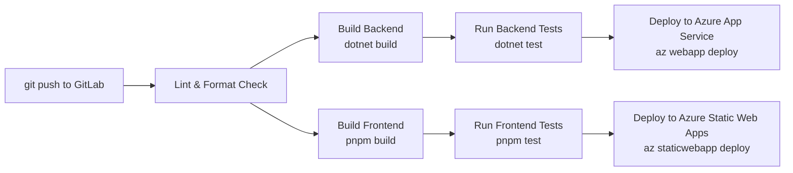

### 8.6 Backup & Recovery

| Item | Policy | Requirement |
|------|--------|-------------|
| SQLite database file | Daily automated backup via App Service backup feature | NFR-26 |
| Backup encryption | Enabled (Azure Storage encryption at rest) | NFR-27 |
| Backup retention | Minimum 30 days | NFR-26 |
| Restore testing | Periodic restore drill | NFR-28 |
| Sync failure recovery | Automatic retry (max 3 attempts) | NFR-12 |

---

---

## 9. Security Architecture

### 9.1 Security Layers Overview

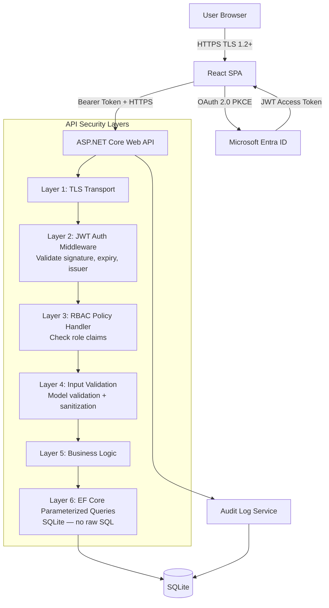

### 9.2 Authentication & Authorization

| Aspect | Implementation | Requirement |
|--------|---------------|-------------|
| **Identity Provider** | Microsoft Entra ID (OAuth 2.0 / OIDC) | NFR-06, FR-2.1 |
| **Frontend Auth Flow** | Authorization Code + PKCE via MSAL Browser | Prevents token interception |
| **Backend Token Validation** | `Microsoft.Identity.Web` — validates JWT signature, issuer, audience, expiry | NFR-06 |
| **Session Expiry** | Access tokens expire per Entra ID policy; idle session timeout 30 min | NFR-10 |
| **RBAC Enforcement** | Role claims from JWT mapped to policy handlers in ASP.NET Core | FR-2.2, NFR-08 |
| **Role Definitions** | Administrator, ProjectManager, ITAdmin — defined as Entra ID App Roles | FR-2.3 |
| **Data Scoping** | Admin → all projects; ProjectManager → assigned projects only; ITAdmin → platform config + logs | BR-06, BR-07, BR-08 |
| **Unauthorized Logging** | All 401/403 responses logged with user identity and endpoint | NFR-09 |

### 9.3 Role-Based Access Control Matrix

| Resource | Administrator | Project Manager | IT Admin |
|----------|:---:|:---:|:---:|
| All Projects & Dashboards | ✅ | Assigned only | ❌ |
| KPI Snapshots | ✅ | Assigned only | ❌ |
| Risk Analysis & AI Recommendations | ✅ | Assigned only | ❌ |
| Executive Reports | ✅ | Assigned only | ❌ |
| Sprint Governance | ✅ | Assigned only | ❌ |
| Sync Job Trigger (Manual) | ✅ | ❌ | ✅ |
| Sync Logs & Application Logs | ✅ | ❌ | ✅ |
| Audit Logs | ✅ | ❌ | ✅ |
| User Management | ✅ | ❌ | ✅ |
| Platform Configuration | ❌ | ❌ | ✅ |

### 9.4 API Security Controls

| Control | Implementation |
|---------|---------------|
| **Transport Security** | HTTPS enforced; HTTP requests redirected to HTTPS; TLS 1.2+ required |
| **JWT Validation** | Signature, issuer, audience, expiry validated on every request |
| **Authorization Checks** | `[Authorize(Policy = "...")]` attributes on all protected controllers |
| **Input Validation** | ASP.NET Core model validation (`[Required]`, `[MaxLength]`, etc.) on all DTOs |
| **SQL Injection Prevention** | EF Core parameterized queries only; no raw SQL string interpolation |
| **CORS** | Configured to allow only the frontend origin; no wildcard `*` |
| **Rate Limiting** | ASP.NET Core rate limiting middleware on auth and AI endpoints |
| **Secrets** | API keys and PAT stored in environment variables; never in source code or logs |
| **Response Headers** | `X-Content-Type-Options`, `X-Frame-Options`, `Content-Security-Policy` headers set |

### 9.5 Audit Logging

| Event | Logged Fields | Requirement |
|-------|--------------|-------------|
| User login | UserId, email, role, timestamp, IP | NFR-20 |
| User logout | UserId, timestamp | NFR-20 |
| Admin activity | UserId, action, target resource, timestamp | NFR-20 |
| Sync job executed | SyncType, StartTime, EndTime, Status, RecordsProcessed, ErrorMessage | NFR-21 |
| AI request sent | ProjectId, endpoint, timestamp, prompt hash | NFR-33 |
| AI response received | ProjectId, risk score/level, timestamp, response hash | NFR-33 |
| Unauthorized access attempt | UserId (if known), endpoint, timestamp, response code | NFR-09 |

**Audit log retention:** 90 days minimum (BR-10, NFR-25).  
**Audit logs searchable** by Administrators and IT Admins (NFR-23).

### 9.6 Data Security

| Concern | Control |
|---------|---------|
| Data at rest | SQLite file on Azure App Service persistent storage — Azure platform encrypts underlying disk (NFR-07) |
| Data in transit | All connections over TLS 1.2+ |
| Secrets at rest | Environment variables / Azure Key Vault — never plaintext in config files |
| Backup encryption | Azure Storage encryption at rest for backup files (NFR-27) |
| AI data governance | Only synchronized project data sent to Azure OpenAI; no PII beyond project names and work item titles (NFR-32) |
| Token storage (frontend) | Access tokens held in MSAL in-memory cache; refresh tokens in session storage — never `localStorage` |

### 9.7 OWASP Top 10 Mitigations

| OWASP Risk | Mitigation Applied |
|------------|------------------|
| A01 Broken Access Control | RBAC on all endpoints; data-level scoping by assigned projects |
| A02 Cryptographic Failures | TLS enforced; secrets in env vars; disk encryption at rest |
| A03 Injection | EF Core parameterized queries; model validation on all inputs |
| A04 Insecure Design | Clean Architecture; defense-in-depth layered security |
| A05 Security Misconfiguration | CORS restricted; response headers configured; no debug info in production |
| A06 Vulnerable Components | Dependency scanning in CI/CD pipeline |
| A07 Auth Failures | Entra ID OAuth 2.0 PKCE; JWT validation; session expiry (NFR-10) |
| A09 Logging Failures | Structured audit logs for all security-relevant events (NFR-20–23) |
| A10 SSRF | Azure DevOps and OpenAI base URLs fixed in config; no user-supplied URLs used in HTTP calls |

---

---

## 10. Non-Functional Requirements

### 10.1 Performance Requirements

| ID | Requirement | Target | Implementation Approach |
|----|-------------|--------|------------------------|
| NFR-01 | Dashboard page load time | < 3 seconds (95th percentile) | Pre-computed `KPISnapshots`; paginated API responses; React lazy loading |
| NFR-02 | Executive report generation | < 30 seconds | Async report generation; streaming OpenAI response where possible |
| NFR-03 | KPI calculations post-sync | < 5 minutes | Background Hosted Service runs KPI Engine immediately after sync completes |
| NFR-04 | AI risk analysis results | < 60 seconds after initiation | Azure OpenAI call with timeout; async processing with status polling |
| NFR-05 | Search and filter operations | < 2 seconds | SQLite indexed queries on `ProjectId`, `SprintId`, `State`, `WorkItemType` |

### 10.2 Security Requirements

| ID | Requirement | Implementation |
|----|-------------|---------------|
| NFR-06 | All authentication via Microsoft Entra ID | OAuth 2.0 PKCE + `Microsoft.Identity.Web` JWT validation |
| NFR-07 | Sensitive data encrypted at rest | Azure App Service disk encryption; SQLite file on encrypted storage |
| NFR-08 | RBAC enforced for all users | `[Authorize(Policy)]` on all API endpoints; role-scoped data queries |
| NFR-09 | Unauthorized access attempts logged | 401/403 responses written to audit log with user identity and endpoint |
| NFR-10 | Sessions expire after 30 min inactivity | MSAL idle timeout configuration; backend token expiry enforcement |

### 10.3 Reliability Requirements

| ID | Requirement | Implementation |
|----|-------------|---------------|
| NFR-11 | Data consistency between Azure DevOps and governance repository | Upsert-based sync; no delete of existing records; history append-only |
| NFR-12 | Failed sync jobs retried up to 3 times | `SyncOrchestrator` retry loop with exponential back-off; failure logged to `SyncLogs` |
| NFR-13 | Failed AI requests logged and retried | `OpenAIClient` retry policy via Polly; failure logged; dashboard unaffected |
| NFR-14 | No duplicate records during sync | Upsert by `AzureProjectId`, `AzureWorkItemId`, `AzureIterationId`, etc. |
| NFR-15 | Critical failures generate administrative alerts | Structured error logs; alert via App Service diagnostics / email notification |

### 10.4 Usability Requirements

| ID | Requirement | Implementation |
|----|-------------|---------------|
| NFR-16 | Consistent look and feel across all modules | shadcn/ui component library + Tailwind CSS design tokens |
| NFR-17 | Optimised for desktop and enterprise laptop displays | Responsive Tailwind grid; minimum viewport 1280px |
| NFR-18 | Key insights accessible within 3 clicks | Dashboard home → project drill-down → KPI/Risk detail (max 2 child routes) |
| NFR-19 | Clear and user-friendly error messages | Standardised error DTO `{code, message, details}`; SPA toast/alert components |

### 10.5 Audit and Logging Requirements

| ID | Requirement | Implementation |
|----|-------------|---------------|
| NFR-20 | All login, logout, and admin activities recorded | `AuditLogService` writes structured records on every auth event and admin action |
| NFR-21 | Sync activities logged with timestamps and status | `SyncLogs` table — StartTime, EndTime, Status, RecordsProcessed, ErrorMessage |
| NFR-22 | AI reports traceable to source data | `ExecutiveReports.ProjectId` + `RiskAnalysis.SprintId` FK chain to raw `KPISnapshots` |
| NFR-23 | Audit logs searchable by administrators | Admin API endpoint with filter by UserId, date range, event type |

### 10.6 Data Retention Requirements

| ID | Requirement | Target | Implementation |
|----|-------------|--------|---------------|
| NFR-24 | KPI historical data retention | 12 months minimum (BRD §8.6); 24 months per BR-11 | No auto-deletion; `KPISnapshots` retained indefinitely in MVP |
| NFR-25 | Audit log retention | 90 days minimum | Scheduled cleanup job removes `AuditLogs` older than 90 days |
| NFR-26 | Daily database backups | Automated daily | Azure App Service Backup to Azure Storage |
| NFR-27 | Backup data encrypted | At rest | Azure Storage default encryption |
| NFR-28 | Backup restoration tested periodically | Periodic drill | Documented restore procedure; tested each release cycle |

### 10.7 AI Governance Requirements

| ID | Requirement | Implementation |
|----|-------------|---------------|
| NFR-29 | AI insights clearly labeled as system-generated | All AI response DTOs include `"isAIGenerated": true`; UI badge on AI content |
| NFR-30 | AI failures do not impact dashboard availability | AI engine failures caught and isolated; dashboard renders from pre-computed `KPISnapshots` |
| NFR-31 | AI recommendations traceable to delivery metrics | `AIRecommendations.RiskAnalysisId` → `RiskAnalysis.SprintId` → `KPISnapshots` |
| NFR-32 | Executive summaries based only on synchronized data | `AIReportEngine` builds prompts exclusively from DB-persisted KPI and risk records |
| NFR-33 | AI request/response logs maintained for audit | `AIAuditLog` table (or Serilog structured log) stores prompt hash, response hash, timestamp, ProjectId |

### 10.8 NFR Summary Dashboard

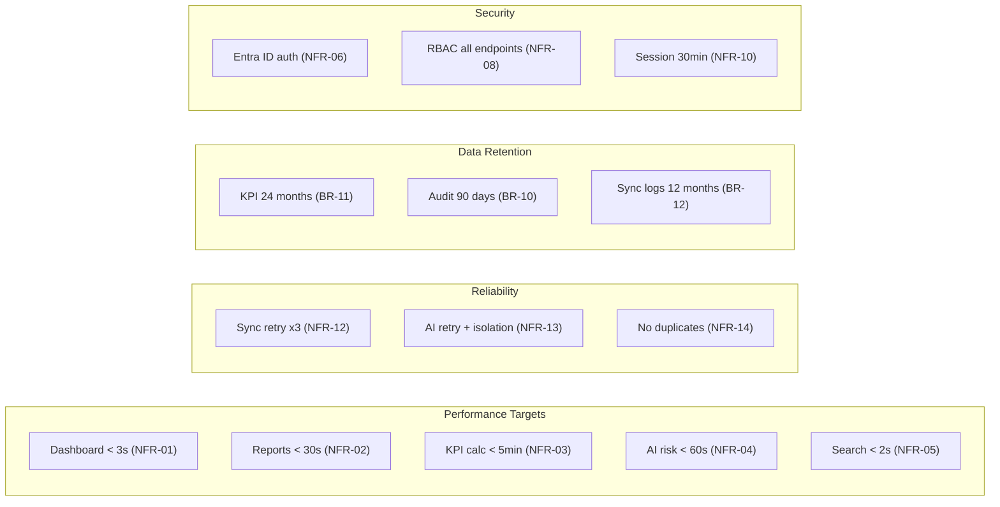

---

---

## 11. Major Workflow Sequences

### 11.1 User Login & Role-Based Dashboard Load (Epic 2 + Epic 7)

```mermaid
sequenceDiagram
  actor USER as User
  participant SPA as React SPA
  participant MSAL as MSAL (Entra ID)
  participant ENTRA as Microsoft Entra ID
  participant API as ASP.NET Core API
  participant DB as SQLite

  USER->>SPA: Open application URL
  SPA->>MSAL: Check cached token
  alt No valid token
    MSAL->>ENTRA: Redirect — Authorization Code + PKCE
    ENTRA-->>USER: Login prompt
    USER->>ENTRA: Enter credentials
    ENTRA-->>MSAL: Authorization code
    MSAL->>ENTRA: Exchange code + code_verifier → tokens
    ENTRA-->>MSAL: JWT access token + ID token
  end
  MSAL-->>SPA: Access token + role claims
  SPA->>SPA: Extract role (Admin / PM / ITAdmin)
  SPA->>API: GET /api/dashboard (Bearer token)
  API->>API: Validate JWT; enforce RBAC policy
  API->>DB: Query role-filtered Projects + KPISnapshots + RiskAnalysis
  DB-->>API: Filtered records
  API-->>SPA: Dashboard DTO (KPIs, risks, project list)
  SPA->>SPA: Render role-specific dashboard
  SPA-->>USER: Dashboard displayed
```

### 11.2 Scheduled Azure DevOps Synchronization (Epic 1)

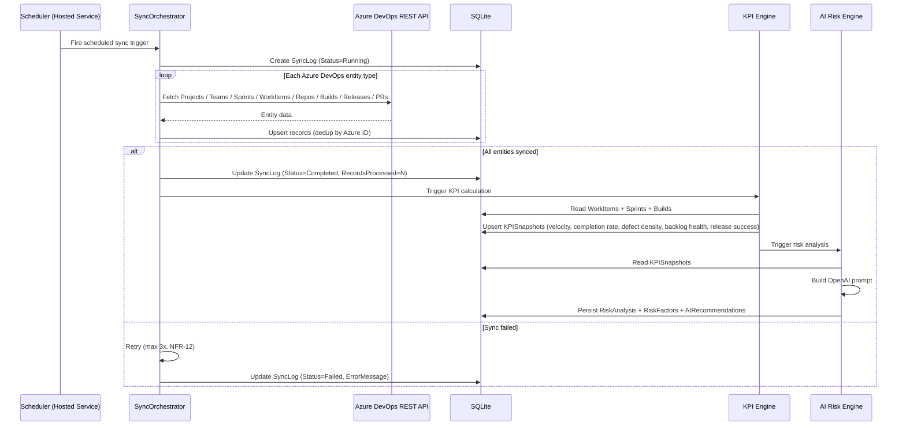

### 11.3 KPI Dashboard View & Drill-Down (Epic 3 + Epic 7)

```mermaid
sequenceDiagram
  actor PM as Project Manager
  participant SPA as React SPA
  participant API as ASP.NET Core API
  participant DB as SQLite

  PM->>SPA: Select project from sidebar
  SPA->>API: GET /api/projects/{id}/kpi
  API->>DB: Query KPISnapshots for project (all sprints)
  DB-->>API: KPI history records
  API-->>SPA: KPI trend data (velocity, completion rate, defect density, backlog health)
  SPA->>SPA: Render VelocityChart, CompletionRate gauge, DefectDensityChart, BacklogHealthGauge

  PM->>SPA: Select specific sprint for drill-down
  SPA->>API: GET /api/projects/{id}/sprints/{sprintId}/workitems
  API->>DB: Query WorkItems for sprint (state, type, story points, assignee)
  DB-->>API: Work item list
  API-->>SPA: Sprint work items
  SPA->>SPA: Render WorkItemTable with delayed items highlighted (State != Completed + EndDate passed)
  SPA-->>PM: Sprint drill-down view
```

### 11.4 AI Risk Analysis View (Epic 5)

```mermaid
sequenceDiagram
  actor ADMIN as Administrator
  participant SPA as React SPA
  participant API as ASP.NET Core API
  participant AIR as AI Risk Engine
  participant OAIC as OpenAIClient
  participant AOAI as Azure OpenAI
  participant DB as SQLite

  ADMIN->>SPA: Open Risk Analysis page
  SPA->>API: GET /api/projects/{id}/risk
  API->>DB: Query latest RiskAnalysis + RiskFactors + AIRecommendations
  DB-->>API: Risk records
  API-->>SPA: RiskAnalysisDTO (score, level, summary, factors, recommendations)
  SPA->>SPA: Render RiskScoreCard (colour-coded: Low/Medium/High/Critical)\nRender AIInsightPanel + RecommendationList

  ADMIN->>SPA: Click "Re-analyse"
  SPA->>API: POST /api/projects/{id}/risk/analyse
  API->>AIR: AnalyseRisk(projectId, sprintId)
  AIR->>DB: Fetch KPISnapshot
  AIR->>OAIC: Send structured prompt
  OAIC->>AOAI: POST /chat/completions
  AOAI-->>OAIC: Risk JSON (score, level, factors, recommendations)
  OAIC-->>AIR: Parsed response
  AIR->>DB: Persist new RiskAnalysis + RiskFactors + AIRecommendations
  AIR-->>API: Updated RiskAnalysisDTO
  API-->>SPA: 200 OK
  SPA->>SPA: Refresh risk view
  SPA-->>ADMIN: Updated risk assessment displayed
```

### 11.5 Executive Report Generation & Download (Epic 6)

```mermaid
sequenceDiagram
  actor USER as Admin / PM
  participant SPA as React SPA
  participant API as ASP.NET Core API
  participant AER as AI Report Engine
  participant DB as SQLite
  participant OAIC as OpenAIClient
  participant AOAI as Azure OpenAI

  USER->>SPA: Navigate to Reports; select project + period
  SPA->>API: POST /api/reports/generate {projectId, period}
  API->>AER: GenerateExecutiveReport(projectId, period)
  AER->>DB: Fetch KPISnapshots for period
  AER->>DB: Fetch RiskAnalysis + AIRecommendations
  AER->>AER: Build executive summary prompt
  AER->>OAIC: POST /chat/completions
  OAIC->>AOAI: Forward prompt
  AOAI-->>OAIC: Executive summary markdown text
  OAIC-->>AER: Summary
  AER->>DB: INSERT ExecutiveReport (Title, Summary, GeneratedDate, GeneratedBy)
  AER-->>API: ReportDTO
  API-->>SPA: 200 OK {reportId, title, summary, generatedDate}
  SPA->>SPA: Render ReportViewer (markdown rendered)
  USER->>SPA: Click "Download PDF"
  SPA->>SPA: Convert markdown to PDF (client-side or server-side)
  SPA-->>USER: PDF downloaded
```

### 11.6 Sprint Governance — Delayed Item Detection (Epic 4)

```mermaid
flowchart TD
  SYNC_DONE[Sync Completed] --> SPRINT_CHECK[SprintService: Evaluate all active sprints]
  SPRINT_CHECK --> LOOP[For each sprint]
  LOOP --> FETCH[Fetch WorkItems where State != Done/Closed]
  FETCH --> DATE_CHECK{EndDate < Today?}
  DATE_CHECK -->|Yes| FLAG[Mark work item as Delayed]
  DATE_CHECK -->|No| HEALTH[Include in sprint health calc]
  FLAG --> CALC[Calculate: Remaining SP / Planned SP]
  CALC --> THRESHOLD{Remaining > 20%?}
  THRESHOLD -->|Yes| ATRISK[Set Sprint = At Risk\nBR-02, BR-05]
  THRESHOLD -->|No| ONTRACK[Set Sprint = On Track]
  ATRISK --> DASHBOARD[Surface on governance dashboard\nBR-14]
  ONTRACK --> DASHBOARD
```

---

> **HLD complete — all 11 sections written to [Requirements/HLD.md](Requirements/HLD.md).**  
> **Awaiting approval to begin LLD generation. Section 1 will cover: Folder Structure & Layer Responsibilities.**
