# Low-Level Design: Sarathi AI — AI-Powered Delivery Governance and KPI Dashboard

**Version:** 1.0  
**Status:** Draft  
**Prepared For:** Digital Engineering Internship Program 2026 — Group 10  
**Organization:** Techwave Consulting India Pvt. Ltd.  
**Date:** July 2026

---

## Table of Contents

1. [Folder Structure & Layer Responsibilities](#1-folder-structure--layer-responsibilities)
2. [Module Responsibilities](#2-module-responsibilities)
3. [Class & Object Design](#3-class--object-design)
4. [Domain Model](#4-domain-model)
5. [Database Schema Mapping](#5-database-schema-mapping)
6. [Entity Relationships](#6-entity-relationships)
7. [Repository Design](#7-repository-design)
8. [Service Design](#8-service-design)
9. [API Specifications](#9-api-specifications)
10. [Background Services](#10-background-services)
11. [Authentication & Authorization Flow](#11-authentication--authorization-flow)
12. [KPI Engine Design](#12-kpi-engine-design)
13. [AI Engine Design](#13-ai-engine-design)
14. [Algorithms & Business Logic](#14-algorithms--business-logic)
15. [Error & Exception Handling](#15-error--exception-handling)
16. [Logging Strategy](#16-logging-strategy)
17. [Configuration Management](#17-configuration-management)
18. [Design Patterns](#18-design-patterns)

---

## 1. Folder Structure & Layer Responsibilities

### 1.1 Backend Folder Structure (ASP.NET Core)

```
Backend/
├── SarathiAI.sln
│
├── SarathiAI.API/                          # Presentation Layer — Web API
│   ├── Controllers/
│   │   ├── AuthController.cs
│   │   ├── ProjectsController.cs
│   │   ├── SprintsController.cs
│   │   ├── WorkItemsController.cs
│   │   ├── KPIController.cs
│   │   ├── RiskController.cs
│   │   ├── ReportsController.cs
│   │   ├── SyncController.cs
│   │   └── AuditController.cs
│   ├── Middleware/
│   │   ├── ExceptionHandlingMiddleware.cs
│   │   └── RequestLoggingMiddleware.cs
│   ├── Filters/
│   │   └── ValidationFilter.cs
│   ├── Extensions/
│   │   ├── ServiceCollectionExtensions.cs  # DI registrations
│   │   └── AuthExtensions.cs
│   ├── appsettings.json
│   ├── appsettings.Development.json
│   └── Program.cs
│
├── SarathiAI.Application/                  # Application Layer — Use Cases
│   ├── Services/
│   │   ├── ProjectService.cs
│   │   ├── SprintService.cs
│   │   ├── WorkItemService.cs
│   │   ├── KPIEngine.cs
│   │   ├── AIRiskEngine.cs
│   │   ├── AIReportEngine.cs
│   │   ├── SyncOrchestrator.cs
│   │   └── AuditLogService.cs
│   ├── Interfaces/
│   │   ├── IProjectService.cs
│   │   ├── ISprintService.cs
│   │   ├── IWorkItemService.cs
│   │   ├── IKPIEngine.cs
│   │   ├── IAIRiskEngine.cs
│   │   ├── IAIReportEngine.cs
│   │   ├── ISyncOrchestrator.cs
│   │   └── IAuditLogService.cs
│   ├── DTOs/
│   │   ├── Request/
│   │   │   ├── GenerateReportRequest.cs
│   │   │   └── TriggerSyncRequest.cs
│   │   └── Response/
│   │       ├── ProjectDto.cs
│   │       ├── SprintDto.cs
│   │       ├── WorkItemDto.cs
│   │       ├── KPISnapshotDto.cs
│   │       ├── RiskAnalysisDto.cs
│   │       ├── ExecutiveReportDto.cs
│   │       ├── DashboardDto.cs
│   │       └── SyncStatusDto.cs
│   └── Validators/
│       ├── GenerateReportRequestValidator.cs
│       └── TriggerSyncRequestValidator.cs
│
├── SarathiAI.Domain/                       # Domain Layer — Entities & Rules
│   ├── Entities/
│   │   ├── Project.cs
│   │   ├── Team.cs
│   │   ├── Sprint.cs
│   │   ├── WorkItem.cs
│   │   ├── WorkItemHistory.cs
│   │   ├── Repository.cs
│   │   ├── PullRequest.cs
│   │   ├── Build.cs
│   │   ├── Release.cs
│   │   ├── User.cs
│   │   ├── SyncLog.cs
│   │   ├── KPISnapshot.cs
│   │   ├── RiskAnalysis.cs
│   │   ├── RiskFactor.cs
│   │   ├── AIRecommendation.cs
│   │   └── ExecutiveReport.cs
│   ├── Enums/
│   │   ├── WorkItemType.cs
│   │   ├── WorkItemState.cs
│   │   ├── RiskLevel.cs
│   │   ├── SprintTimeFrame.cs
│   │   └── SyncStatus.cs
│   ├── Constants/
│   │   └── BusinessRules.cs                # BR-01 to BR-14 as constants
│   └── Exceptions/
│       ├── DomainException.cs
│       ├── SyncFailedException.cs
│       └── AIProcessingException.cs
│
├── SarathiAI.Infrastructure/               # Infrastructure Layer
│   ├── Persistence/
│   │   ├── AppDbContext.cs                  # EF Core DbContext
│   │   ├── Configurations/                  # IEntityTypeConfiguration per entity
│   │   │   ├── ProjectConfiguration.cs
│   │   │   ├── WorkItemConfiguration.cs
│   │   │   └── ... (one per entity)
│   │   └── Migrations/                      # EF Core migration files
│   ├── Repositories/
│   │   ├── ProjectRepository.cs
│   │   ├── SprintRepository.cs
│   │   ├── WorkItemRepository.cs
│   │   ├── KPISnapshotRepository.cs
│   │   ├── RiskAnalysisRepository.cs
│   │   ├── AIRecommendationRepository.cs
│   │   ├── ExecutiveReportRepository.cs
│   │   ├── SyncLogRepository.cs
│   │   └── AuditLogRepository.cs
│   ├── Interfaces/
│   │   ├── IProjectRepository.cs
│   │   ├── ISprintRepository.cs
│   │   └── ... (one per repository)
│   ├── ExternalClients/
│   │   ├── AzureDevOpsClient.cs
│   │   └── OpenAIClient.cs
│   ├── ExternalClients/Interfaces/
│   │   ├── IAzureDevOpsClient.cs
│   │   └── IOpenAIClient.cs
│   └── BackgroundServices/
│       └── SyncHostedService.cs
│
└── SarathiAI.Tests/                        # Test Project
    ├── Unit/
    │   ├── KPIEngineTests.cs
    │   ├── SyncOrchestratorTests.cs
    │   └── AIRiskEngineTests.cs
    └── Integration/
        └── APIIntegrationTests.cs
```

### 1.2 Frontend Folder Structure (React + TypeScript)

```
Frontend/
├── index.html
├── vite.config.ts
├── package.json
├── tsconfig.json
├── .env.development
├── .env.production
│
└── src/
    ├── main.tsx                            # App entry point
    │
    └── app/
        ├── App.tsx                         # Root component — Router + Providers
        │
        ├── api/                            # API client layer
        │   ├── axiosInstance.ts            # Axios with JWT interceptor
        │   ├── projectsApi.ts
        │   ├── sprintsApi.ts
        │   ├── workItemsApi.ts
        │   ├── kpiApi.ts
        │   ├── riskApi.ts
        │   ├── reportsApi.ts
        │   ├── syncApi.ts
        │   └── auditApi.ts
        │
        ├── auth/                           # MSAL + Auth context
        │   ├── msalConfig.ts
        │   ├── AuthContext.tsx
        │   ├── AuthProvider.tsx
        │   └── AuthGuard.tsx               # Route protection by role
        │
        ├── hooks/                          # Custom React hooks
        │   ├── useProjects.ts
        │   ├── useKPI.ts
        │   ├── useRisk.ts
        │   └── useRole.ts
        │
        ├── pages/                          # Route-level page components
        │   ├── Dashboard/
        │   │   └── DashboardPage.tsx
        │   ├── Projects/
        │   │   ├── ProjectsPage.tsx
        │   │   └── ProjectDetailPage.tsx
        │   ├── Sprints/
        │   │   └── SprintGovernancePage.tsx
        │   ├── KPI/
        │   │   └── KPIDashboardPage.tsx
        │   ├── Risk/
        │   │   └── RiskAnalysisPage.tsx
        │   ├── Reports/
        │   │   └── ExecutiveReportsPage.tsx
        │   └── Admin/
        │       ├── AdminPanelPage.tsx
        │       ├── SyncStatusPage.tsx
        │       └── AuditLogPage.tsx
        │
        ├── components/                     # Reusable UI components
        │   ├── ui/                         # shadcn/ui primitives (existing)
        │   ├── charts/
        │   │   ├── VelocityChart.tsx
        │   │   ├── BurndownChart.tsx
        │   │   ├── DefectDensityChart.tsx
        │   │   └── BacklogHealthGauge.tsx
        │   ├── cards/
        │   │   ├── KPICard.tsx
        │   │   ├── RiskScoreCard.tsx
        │   │   └── ProjectHealthCard.tsx
        │   ├── tables/
        │   │   ├── WorkItemTable.tsx
        │   │   └── AuditLogTable.tsx
        │   └── shared/
        │       ├── AIBadge.tsx             # "AI Generated" label (NFR-29)
        │       ├── ErrorBoundary.tsx
        │       └── LoadingSpinner.tsx
        │
        ├── types/                          # TypeScript interfaces
        │   ├── project.types.ts
        │   ├── sprint.types.ts
        │   ├── workitem.types.ts
        │   ├── kpi.types.ts
        │   ├── risk.types.ts
        │   └── report.types.ts
        │
        └── styles/                         # Global styles (existing)
            ├── globals.css
            └── theme.css
```

### 1.3 Layer Responsibilities

| Layer | Project | Responsibility | Depends On |
|-------|---------|---------------|-----------|
| **Presentation** | `SarathiAI.API` | HTTP request/response handling, routing, auth middleware, model validation, error formatting | Application |
| **Application** | `SarathiAI.Application` | Use-case orchestration, business workflow coordination, DTO mapping, service interfaces | Domain, Infrastructure interfaces |
| **Domain** | `SarathiAI.Domain` | Business entities, domain rules (BR-01–BR-14), enums, domain exceptions | None (no external dependencies) |
| **Infrastructure** | `SarathiAI.Infrastructure` | EF Core + SQLite persistence, Azure DevOps HTTP client, Azure OpenAI HTTP client, repositories, hosted services | Domain |
| **Frontend SPA** | `Frontend/src` | UI rendering, user interaction, role-based routing, API consumption, MSAL auth | API (via HTTPS) |

### 1.4 Dependency Rule

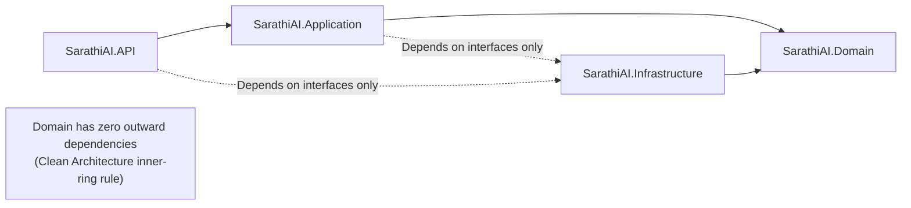

> Arrows point inward toward Domain. Infrastructure implements interfaces defined in Application/Domain — no reverse dependencies.

---

---

## 2. Module Responsibilities

### 2.1 Backend Modules

#### SarathiAI.API — Controllers

| Controller | Route Prefix | Epic | Responsibility |
|------------|-------------|------|---------------|
| `AuthController` | `/api/auth` | Epic 2 | Login redirect info, logout, current user profile + role claims |
| `ProjectsController` | `/api/projects` | Epic 1, 7 | CRUD-read for projects; role-filtered list and detail |
| `SprintsController` | `/api/projects/{id}/sprints` | Epic 4 | Sprint list, sprint detail, sprint health, delayed work items |
| `WorkItemsController` | `/api/projects/{id}/workitems` | Epic 4 | Work items per project/sprint; filter by type, state, assignee |
| `KPIController` | `/api/projects/{id}/kpi` | Epic 3 | KPI snapshots per project; trend history; sprint-level KPIs |
| `RiskController` | `/api/projects/{id}/risk` | Epic 5 | Latest risk analysis; trigger manual re-analysis |
| `ReportsController` | `/api/reports` | Epic 6 | Generate executive report; list reports; get report by ID |
| `SyncController` | `/api/sync` | Epic 1 | Trigger manual sync; get sync status and logs |
| `AuditController` | `/api/audit` | Epic 2 | Query audit logs (Admin + ITAdmin only); filter by user/date/event |

#### SarathiAI.Application — Services

| Service | Interfaces | Epic | Responsibility |
|---------|-----------|------|---------------|
| `ProjectService` | `IProjectService` | Epic 1, 7 | Retrieve role-filtered project list and detail; map entity → DTO |
| `SprintService` | `ISprintService` | Epic 4 | Get sprints per project; evaluate sprint health; identify delayed items (BR-05) |
| `WorkItemService` | `IWorkItemService` | Epic 4 | Query work items with filters; aggregate story points by state |
| `KPIEngine` | `IKPIEngine` | Epic 3 | Calculate all 5 KPI metrics per sprint; store `KPISnapshot`; evaluate thresholds (BR-01–05) |
| `AIRiskEngine` | `IAIRiskEngine` | Epic 5 | Build risk prompt; call `IOpenAIClient`; parse response; persist `RiskAnalysis`, `RiskFactors`, `AIRecommendations`; classify risk level (BR-13) |
| `AIReportEngine` | `IAIReportEngine` | Epic 6 | Fetch KPI + risk data; build executive prompt; call `IOpenAIClient`; persist `ExecutiveReport` |
| `SyncOrchestrator` | `ISyncOrchestrator` | Epic 1 | Coordinate full Azure DevOps sync sequence; manage `SyncLog`; trigger post-sync KPI + AI processing |
| `AuditLogService` | `IAuditLogService` | Epic 2 | Write audit events (login, logout, admin action, AI call); enforce 90-day retention |

#### SarathiAI.Infrastructure — Repositories

| Repository | Interface | Table | Responsibility |
|------------|----------|-------|---------------|
| `ProjectRepository` | `IProjectRepository` | `Projects` | Upsert by `AzureProjectId`; get by ID; get all; get by user assignment |
| `SprintRepository` | `ISprintRepository` | `Sprints` | Upsert by `AzureIterationId`; get active sprints; get by project |
| `WorkItemRepository` | `IWorkItemRepository` | `WorkItems` + `WorkItemHistory` | Upsert by `AzureWorkItemId`; append history; filter by sprint/state/type |
| `KPISnapshotRepository` | `IKPISnapshotRepository` | `KPISnapshots` | Upsert by `(ProjectId, SprintId, SnapshotDate)`; get history by project |
| `RiskAnalysisRepository` | `IRiskAnalysisRepository` | `RiskAnalysis` + `RiskFactors` | Insert new analysis; get latest by project/sprint; get history |
| `AIRecommendationRepository` | `IAIRecommendationRepository` | `AIRecommendations` | Insert recommendations; get by project; get by risk analysis ID |
| `ExecutiveReportRepository` | `IExecutiveReportRepository` | `ExecutiveReports` | Insert report; get by project; get by ID |
| `SyncLogRepository` | `ISyncLogRepository` | `SyncLogs` | Create/update sync log entry; get recent logs; get by status |
| `AuditLogRepository` | `IAuditLogRepository` | (AuditLogs table) | Insert audit event; query by user/date/type; delete entries older than 90 days |

#### SarathiAI.Infrastructure — External Clients

| Client | Interface | Responsibility |
|--------|----------|---------------|
| `AzureDevOpsClient` | `IAzureDevOpsClient` | HTTP calls to Azure DevOps REST API v7 with PAT auth; typed response models per entity; handles pagination |
| `OpenAIClient` | `IOpenAIClient` | HTTP calls to Azure OpenAI via `Azure.AI.OpenAI` SDK; constructs `ChatCompletionsOptions`; parses JSON response; Polly retry policy |

### 2.2 Frontend Modules

| Module | Path | Responsibility |
|--------|------|---------------|
| **Auth Module** | `src/app/auth/` | MSAL configuration, `AuthProvider`, `AuthGuard` — protects routes by role; exposes `useRole()` hook |
| **API Module** | `src/app/api/` | Per-resource Axios functions; shared `axiosInstance` with JWT Bearer interceptor and 401 auto-redirect |
| **Dashboard Module** | `src/app/pages/Dashboard/` | Aggregates KPI cards, risk badges, project health overview for the logged-in role |
| **Projects Module** | `src/app/pages/Projects/` | Project list (role-filtered) and project detail with KPI summary |
| **Sprint Governance Module** | `src/app/pages/Sprints/` | Sprint selector, burndown chart, planned vs completed comparison, delayed item table |
| **KPI Dashboard Module** | `src/app/pages/KPI/` | Trend charts (velocity, completion rate, defect density, backlog health, release success) with sprint filter |
| **Risk Analysis Module** | `src/app/pages/Risk/` | Risk score card (colour-coded), AI insight panel, recommendations list, manual re-analyse trigger |
| **Reports Module** | `src/app/pages/Reports/` | Report generation form, report list, report viewer (markdown render), PDF download |
| **Admin Module** | `src/app/pages/Admin/` | Sync status panel, manual sync trigger, user table, audit log table with filters |
| **Charts Components** | `src/app/components/charts/` | Reusable Recharts wrappers — `VelocityChart`, `BurndownChart`, `DefectDensityChart`, `BacklogHealthGauge` |
| **Cards Components** | `src/app/components/cards/` | `KPICard`, `RiskScoreCard`, `ProjectHealthCard` — display metric + trend indicator |
| **Shared Components** | `src/app/components/shared/` | `AIBadge` (NFR-29), `ErrorBoundary`, `LoadingSpinner` |
| **Types Module** | `src/app/types/` | TypeScript interfaces matching backend DTOs; single source of truth for type safety |

### 2.3 Module Dependency Map

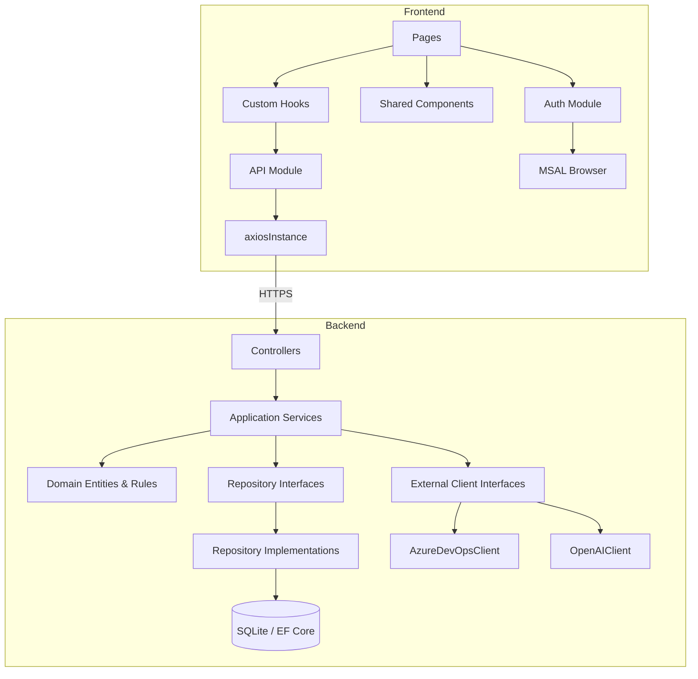

---

---

## 3. Class & Object Design

### 3.1 Domain Entity Classes

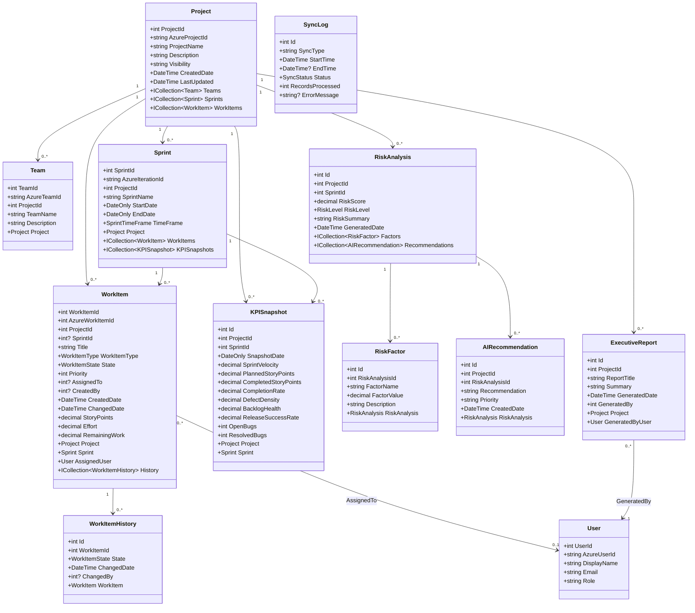

### 3.2 Application Service Interfaces

```mermaid
classDiagram
  class IProjectService {
    <<interface>>
    +GetAllAsync(userId, role) Task~List~ProjectDto~~
    +GetByIdAsync(projectId, userId, role) Task~ProjectDto~
  }

  class ISprintService {
    <<interface>>
    +GetByProjectAsync(projectId) Task~List~SprintDto~~
    +GetSprintHealthAsync(sprintId) Task~SprintHealthDto~
    +GetDelayedItemsAsync(sprintId) Task~List~WorkItemDto~~
  }

  class IKPIEngine {
    <<interface>>
    +CalculateAsync(projectId, sprintId) Task~KPISnapshotDto~
    +CalculateAllAsync(projectId) Task~List~KPISnapshotDto~~
    +GetTrendAsync(projectId) Task~List~KPISnapshotDto~~
  }

  class IAIRiskEngine {
    <<interface>>
    +AnalyseRiskAsync(projectId, sprintId) Task~RiskAnalysisDto~
    +GetLatestRiskAsync(projectId) Task~RiskAnalysisDto~
  }

  class IAIReportEngine {
    <<interface>>
    +GenerateReportAsync(projectId, period) Task~ExecutiveReportDto~
    +GetReportsAsync(projectId) Task~List~ExecutiveReportDto~~
  }

  class ISyncOrchestrator {
    <<interface>>
    +RunFullSyncAsync() Task
    +GetSyncStatusAsync() Task~SyncStatusDto~
  }

  class IAuditLogService {
    <<interface>>
    +LogAsync(userId, action, resource, details) Task
    +GetLogsAsync(filter) Task~List~AuditLogDto~~
    +PurgeOldLogsAsync() Task
  }
```

### 3.3 Repository Interfaces

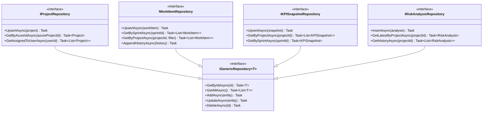

### 3.4 DTO Classes

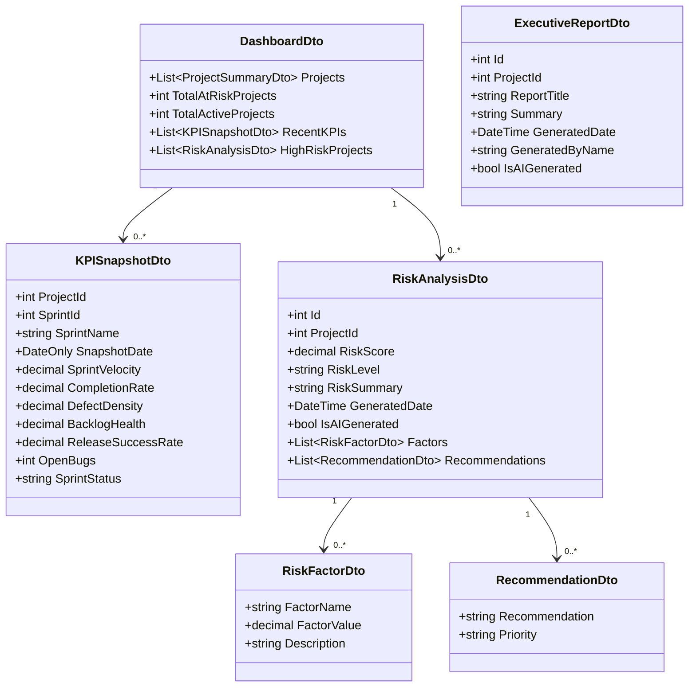

### 3.5 Enums

| Enum | Values |
|------|--------|
| `WorkItemType` | `Epic`, `Feature`, `UserStory`, `Task`, `Bug`, `Issue` |
| `WorkItemState` | `New`, `Active`, `Resolved`, `Closed`, `Removed` |
| `RiskLevel` | `Low` (0–30), `Medium` (31–60), `High` (61–80), `Critical` (81–100) |
| `SprintTimeFrame` | `Past`, `Current`, `Future` |
| `SyncStatus` | `Running`, `Completed`, `Failed`, `PartialSuccess` |
| `ReportPriority` | `Low`, `Medium`, `High`, `Critical` |

---

---

## 4. Domain Model

### 4.1 Core Domain Concepts

The domain is organised around six core aggregates. Each aggregate has a root entity that owns all consistency boundaries within it.

| Aggregate Root | Child Entities | Domain Responsibility |
|---------------|---------------|----------------------|
| `Project` | `Team`, `Sprint`, `WorkItem`, `Repository`, `Build`, `Release` | Central governance unit; all delivery data belongs to a project |
| `WorkItem` | `WorkItemHistory` | Tracks a single unit of work through its lifecycle; history is append-only |
| `KPISnapshot` | — | Immutable computed metric record for a sprint at a point in time |
| `RiskAnalysis` | `RiskFactor`, `AIRecommendation` | AI-evaluated delivery risk assessment for a project/sprint combination |
| `ExecutiveReport` | — | AI-generated narrative summary for leadership consumption |
| `SyncLog` | — | Operational record of a single Azure DevOps synchronisation run |

### 4.2 Domain Model Diagram

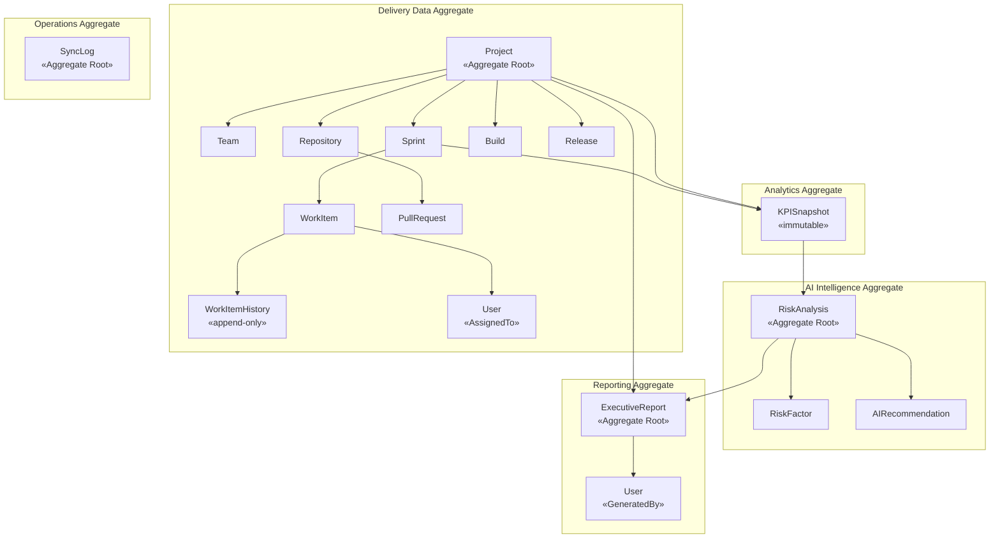

### 4.3 Business Rules Encoded in Domain

All business rules from BRD §7 are encoded as constants and validation methods in `SarathiAI.Domain`.

#### `BusinessRules.cs` Constants

```
// BR-01 — Sprint Completion Rate formula
CompletionRate = (CompletedStoryPoints / PlannedStoryPoints) × 100

// BR-02 — Sprint At Risk threshold
SprintAtRiskThreshold = 80.0m  // < 80% completion rate = At Risk

// BR-03 — Defect Density formula
DefectDensity = TotalDefects / CompletedStoryPoints

// BR-04 — Backlog Health classification
BacklogHealthy    = 85.0m   // > 85%
BacklogModerate   = 70.0m   // 70–85%
// < 70% = Poor

// BR-05 — Project Delayed threshold
ProjectDelayedThreshold = 20.0m  // > 20% planned work remaining after sprint closure

// BR-13 — Risk Score classification
RiskLow      = 30   // 0–30
RiskMedium   = 60   // 31–60
RiskHigh     = 80   // 61–80
RiskCritical = 100  // 81–100
```

#### `KPISnapshot` Domain Methods

| Method | Logic | Business Rule |
|--------|-------|--------------|
| `GetSprintStatus()` | Returns `"At Risk"` if `CompletionRate < 80`, else `"On Track"` | BR-02 |
| `GetBacklogClassification()` | Returns `"Healthy"` / `"Moderate"` / `"Poor"` based on thresholds | BR-04 |
| `IsProjectDelayed()` | Returns `true` if `(PlannedSP - CompletedSP) / PlannedSP > 0.20` | BR-05 |

#### `RiskAnalysis` Domain Methods

| Method | Logic | Business Rule |
|--------|-------|--------------|
| `ClassifyRiskLevel(score)` | Maps score to `RiskLevel` enum using BR-13 ranges | BR-13 |
| `RequiresGovernanceDashboard()` | Returns `true` if `RiskLevel == High \|\| RiskLevel == Critical` | BR-14 |

### 4.4 Domain Invariants

| Invariant | Enforcement Point |
|-----------|------------------|
| `PlannedStoryPoints` must be > 0 before completion rate is calculated | `KPIEngine` — guard clause before division |
| `WorkItemHistory` records are never updated, only inserted | `WorkItemRepository.AppendHistoryAsync()` — insert only, no update |
| `KPISnapshot` is unique per `(ProjectId, SprintId, SnapshotDate)` | EF Core unique index in `KPISnapshotConfiguration` |
| `RiskScore` must be between 0 and 100 | Domain entity setter validation |
| `ExecutiveReport.Summary` must not be empty | `AIReportEngine` — throws `AIProcessingException` if OpenAI returns empty |
| User can only access projects they are assigned to (unless Admin) | `ProjectService.GetAllAsync()` — filters by `userId` for `ProjectManager` role |

### 4.5 Domain Exceptions

| Exception Class | When Thrown |
|----------------|-------------|
| `DomainException` | Base class for all domain-level rule violations |
| `SyncFailedException` | Thrown by `SyncOrchestrator` after 3 failed retry attempts |
| `AIProcessingException` | Thrown by `AIRiskEngine` / `AIReportEngine` when OpenAI returns invalid or empty response |
| `UnauthorizedProjectAccessException` | Thrown when a `ProjectManager` attempts to access a project not assigned to them |

---

---

## 5. Database Schema Mapping

### 5.1 EF Core DbContext

`AppDbContext` registers all 16 entity sets and applies per-entity `IEntityTypeConfiguration<T>` classes.

```
AppDbContext : DbContext
  DbSet<Project>           Projects
  DbSet<Team>              Teams
  DbSet<Sprint>            Sprints
  DbSet<WorkItem>          WorkItems
  DbSet<WorkItemHistory>   WorkItemHistory
  DbSet<Repository>        Repositories
  DbSet<PullRequest>       PullRequests
  DbSet<Build>             Builds
  DbSet<Release>           Releases
  DbSet<User>              Users
  DbSet<SyncLog>           SyncLogs
  DbSet<KPISnapshot>       KPISnapshots
  DbSet<RiskAnalysis>      RiskAnalysis
  DbSet<RiskFactor>        RiskFactors
  DbSet<AIRecommendation>  AIRecommendations
  DbSet<ExecutiveReport>   ExecutiveReports
```

### 5.2 Table Schema — Full Mapping

#### Projects

| Column | SQLite Type | EF Core Mapping | Constraints |
|--------|------------|----------------|-------------|
| `ProjectId` | INTEGER | `int` PK, `ValueGeneratedOnAdd` | PK, NOT NULL |
| `AzureProjectId` | TEXT | `string`, MaxLength(100) | NOT NULL, UNIQUE INDEX |
| `ProjectName` | TEXT | `string`, MaxLength(200) | NOT NULL |
| `Description` | TEXT | `string?` | NULLABLE |
| `Visibility` | TEXT | `string`, MaxLength(20) | NOT NULL, DEFAULT 'Private' |
| `CreatedDate` | TEXT | `DateTime` | NOT NULL |
| `LastUpdated` | TEXT | `DateTime` | NOT NULL |

#### Teams

| Column | SQLite Type | EF Core Mapping | Constraints |
|--------|------------|----------------|-------------|
| `TeamId` | INTEGER | `int` PK | PK, NOT NULL |
| `AzureTeamId` | TEXT | `string`, MaxLength(100) | NOT NULL, UNIQUE INDEX |
| `ProjectId` | INTEGER | `int` FK → Projects | NOT NULL, FK |
| `TeamName` | TEXT | `string`, MaxLength(150) | NOT NULL |
| `Description` | TEXT | `string?` | NULLABLE |

#### Sprints

| Column | SQLite Type | EF Core Mapping | Constraints |
|--------|------------|----------------|-------------|
| `SprintId` | INTEGER | `int` PK | PK, NOT NULL |
| `AzureIterationId` | TEXT | `string`, MaxLength(100) | NOT NULL, UNIQUE INDEX |
| `ProjectId` | INTEGER | `int` FK → Projects | NOT NULL, FK |
| `SprintName` | TEXT | `string`, MaxLength(150) | NOT NULL |
| `StartDate` | TEXT | `DateOnly` | NULLABLE |
| `EndDate` | TEXT | `DateOnly` | NULLABLE |
| `TimeFrame` | TEXT | `SprintTimeFrame` enum → string | NOT NULL |

#### WorkItems

| Column | SQLite Type | EF Core Mapping | Constraints |
|--------|------------|----------------|-------------|
| `WorkItemId` | INTEGER | `int` PK | PK, NOT NULL |
| `AzureWorkItemId` | INTEGER | `int` | NOT NULL, UNIQUE INDEX |
| `ProjectId` | INTEGER | `int` FK → Projects | NOT NULL, FK |
| `SprintId` | INTEGER | `int?` FK → Sprints | NULLABLE, FK |
| `Title` | TEXT | `string`, MaxLength(300) | NOT NULL |
| `WorkItemType` | TEXT | `WorkItemType` enum → string | NOT NULL |
| `State` | TEXT | `WorkItemState` enum → string | NOT NULL |
| `Priority` | INTEGER | `int` | NOT NULL, DEFAULT 2 |
| `AssignedTo` | INTEGER | `int?` FK → Users | NULLABLE, FK |
| `CreatedBy` | INTEGER | `int?` FK → Users | NULLABLE, FK |
| `CreatedDate` | TEXT | `DateTime` | NOT NULL |
| `ChangedDate` | TEXT | `DateTime` | NOT NULL |
| `StoryPoints` | REAL | `decimal(5,2)` | NULLABLE |
| `Effort` | REAL | `decimal(5,2)` | NULLABLE |
| `RemainingWork` | REAL | `decimal(5,2)` | NULLABLE |

#### WorkItemHistory

| Column | SQLite Type | EF Core Mapping | Constraints |
|--------|------------|----------------|-------------|
| `Id` | INTEGER | `int` PK | PK, NOT NULL |
| `WorkItemId` | INTEGER | `int` FK → WorkItems | NOT NULL, FK |
| `State` | TEXT | `WorkItemState` enum → string | NOT NULL |
| `ChangedDate` | TEXT | `DateTime` | NOT NULL |
| `ChangedBy` | INTEGER | `int?` FK → Users | NULLABLE, FK |

#### Repositories

| Column | SQLite Type | EF Core Mapping | Constraints |
|--------|------------|----------------|-------------|
| `RepositoryId` | INTEGER | `int` PK | PK, NOT NULL |
| `AzureRepoId` | TEXT | `string`, MaxLength(100) | NOT NULL, UNIQUE INDEX |
| `ProjectId` | INTEGER | `int` FK → Projects | NOT NULL, FK |
| `RepositoryName` | TEXT | `string`, MaxLength(200) | NOT NULL |
| `DefaultBranch` | TEXT | `string`, MaxLength(100) | NULLABLE |
| `Size` | INTEGER | `long` | NULLABLE |
| `Url` | TEXT | `string`, MaxLength(500) | NULLABLE |

#### PullRequests

| Column | SQLite Type | EF Core Mapping | Constraints |
|--------|------------|----------------|-------------|
| `PullRequestId` | INTEGER | `int` PK | PK, NOT NULL |
| `AzurePRId` | INTEGER | `int` | NOT NULL, UNIQUE INDEX per repo |
| `RepositoryId` | INTEGER | `int` FK → Repositories | NOT NULL, FK |
| `Title` | TEXT | `string`, MaxLength(300) | NOT NULL |
| `Status` | TEXT | `string`, MaxLength(50) | NOT NULL |
| `SourceBranch` | TEXT | `string`, MaxLength(100) | NOT NULL |
| `TargetBranch` | TEXT | `string`, MaxLength(100) | NOT NULL |
| `CreatedBy` | INTEGER | `int?` FK → Users | NULLABLE, FK |
| `CreatedDate` | TEXT | `DateTime` | NOT NULL |
| `ClosedDate` | TEXT | `DateTime?` | NULLABLE |
| `IsDraft` | INTEGER | `bool` | NOT NULL, DEFAULT 0 |
| `MergeStatus` | TEXT | `string`, MaxLength(50) | NULLABLE |

#### Builds

| Column | SQLite Type | EF Core Mapping | Constraints |
|--------|------------|----------------|-------------|
| `BuildId` | INTEGER | `int` PK | PK, NOT NULL |
| `AzureBuildId` | INTEGER | `int` | NOT NULL, UNIQUE INDEX |
| `ProjectId` | INTEGER | `int` FK → Projects | NOT NULL, FK |
| `DefinitionName` | TEXT | `string`, MaxLength(200) | NOT NULL |
| `BuildNumber` | TEXT | `string`, MaxLength(100) | NOT NULL |
| `Status` | TEXT | `string`, MaxLength(50) | NOT NULL |
| `Result` | TEXT | `string?`, MaxLength(50) | NULLABLE |
| `StartTime` | TEXT | `DateTime` | NOT NULL |
| `FinishTime` | TEXT | `DateTime?` | NULLABLE |

#### Releases

| Column | SQLite Type | EF Core Mapping | Constraints |
|--------|------------|----------------|-------------|
| `ReleaseId` | INTEGER | `int` PK | PK, NOT NULL |
| `ProjectId` | INTEGER | `int` FK → Projects | NOT NULL, FK |
| `ReleaseName` | TEXT | `string`, MaxLength(200) | NOT NULL |
| `Status` | TEXT | `string`, MaxLength(50) | NOT NULL |
| `CreatedDate` | TEXT | `DateTime` | NOT NULL |
| `CompletedDate` | TEXT | `DateTime?` | NULLABLE |

#### Users

| Column | SQLite Type | EF Core Mapping | Constraints |
|--------|------------|----------------|-------------|
| `UserId` | INTEGER | `int` PK | PK, NOT NULL |
| `AzureUserId` | TEXT | `string`, MaxLength(100) | NOT NULL, UNIQUE INDEX |
| `DisplayName` | TEXT | `string`, MaxLength(150) | NOT NULL |
| `Email` | TEXT | `string`, MaxLength(200) | NOT NULL, UNIQUE INDEX |
| `Role` | TEXT | `string`, MaxLength(100) | NOT NULL |

#### SyncLogs

| Column | SQLite Type | EF Core Mapping | Constraints |
|--------|------------|----------------|-------------|
| `Id` | INTEGER | `int` PK | PK, NOT NULL |
| `SyncType` | TEXT | `string`, MaxLength(50) | NOT NULL |
| `StartTime` | TEXT | `DateTime` | NOT NULL |
| `EndTime` | TEXT | `DateTime?` | NULLABLE |
| `Status` | TEXT | `SyncStatus` enum → string | NOT NULL |
| `RecordsProcessed` | INTEGER | `int` | NOT NULL, DEFAULT 0 |
| `ErrorMessage` | TEXT | `string?` | NULLABLE |

#### KPISnapshots

| Column | SQLite Type | EF Core Mapping | Constraints |
|--------|------------|----------------|-------------|
| `Id` | INTEGER | `int` PK | PK, NOT NULL |
| `ProjectId` | INTEGER | `int` FK → Projects | NOT NULL, FK |
| `SprintId` | INTEGER | `int` FK → Sprints | NOT NULL, FK |
| `SnapshotDate` | TEXT | `DateOnly` | NOT NULL |
| `SprintVelocity` | REAL | `decimal(10,2)` | NOT NULL |
| `PlannedStoryPoints` | REAL | `decimal(10,2)` | NOT NULL |
| `CompletedStoryPoints` | REAL | `decimal(10,2)` | NOT NULL |
| `CompletionRate` | REAL | `decimal(5,2)` | NOT NULL |
| `DefectDensity` | REAL | `decimal(8,4)` | NOT NULL |
| `BacklogHealth` | REAL | `decimal(5,2)` | NOT NULL |
| `ReleaseSuccessRate` | REAL | `decimal(5,2)` | NOT NULL |
| `OpenBugs` | INTEGER | `int` | NOT NULL |
| `ResolvedBugs` | INTEGER | `int` | NOT NULL |

> Unique index on `(ProjectId, SprintId, SnapshotDate)` enforced in `KPISnapshotConfiguration`.

#### RiskAnalysis

| Column | SQLite Type | EF Core Mapping | Constraints |
|--------|------------|----------------|-------------|
| `Id` | INTEGER | `int` PK | PK, NOT NULL |
| `ProjectId` | INTEGER | `int` FK → Projects | NOT NULL, FK |
| `SprintId` | INTEGER | `int` FK → Sprints | NOT NULL, FK |
| `RiskScore` | REAL | `decimal(5,2)` | NOT NULL, CHECK(0–100) |
| `RiskLevel` | TEXT | `RiskLevel` enum → string | NOT NULL |
| `RiskSummary` | TEXT | `string` | NOT NULL |
| `GeneratedDate` | TEXT | `DateTime` | NOT NULL |

#### RiskFactors

| Column | SQLite Type | EF Core Mapping | Constraints |
|--------|------------|----------------|-------------|
| `Id` | INTEGER | `int` PK | PK, NOT NULL |
| `RiskAnalysisId` | INTEGER | `int` FK → RiskAnalysis | NOT NULL, FK |
| `FactorName` | TEXT | `string`, MaxLength(200) | NOT NULL |
| `FactorValue` | REAL | `decimal(8,4)` | NOT NULL |
| `Description` | TEXT | `string` | NULLABLE |

#### AIRecommendations

| Column | SQLite Type | EF Core Mapping | Constraints |
|--------|------------|----------------|-------------|
| `Id` | INTEGER | `int` PK | PK, NOT NULL |
| `ProjectId` | INTEGER | `int` FK → Projects | NOT NULL, FK |
| `RiskAnalysisId` | INTEGER | `int` FK → RiskAnalysis | NOT NULL, FK |
| `Recommendation` | TEXT | `string` | NOT NULL |
| `Priority` | TEXT | `string`, MaxLength(20) | NOT NULL |
| `CreatedDate` | TEXT | `DateTime` | NOT NULL |

#### ExecutiveReports

| Column | SQLite Type | EF Core Mapping | Constraints |
|--------|------------|----------------|-------------|
| `Id` | INTEGER | `int` PK | PK, NOT NULL |
| `ProjectId` | INTEGER | `int` FK → Projects | NOT NULL, FK |
| `ReportTitle` | TEXT | `string`, MaxLength(300) | NOT NULL |
| `Summary` | TEXT | `string` | NOT NULL |
| `GeneratedDate` | TEXT | `DateTime` | NOT NULL |
| `GeneratedBy` | INTEGER | `int` FK → Users | NOT NULL, FK |

### 5.3 SQLite-Specific Notes

| Concern | Handling |
|---------|---------|
| `DateTime` storage | Stored as ISO 8601 TEXT (`"yyyy-MM-ddTHH:mm:ss"`); EF Core handles conversion |
| `DateOnly` storage | Stored as TEXT (`"yyyy-MM-dd"`); custom `ValueConverter` in EF Core |
| `decimal` storage | Stored as REAL; precision defined via `HasPrecision()` in configurations |
| `bool` storage | Stored as INTEGER (0/1); EF Core default |
| `enum` storage | Stored as TEXT via `HasConversion<string>()`; readable in DB tooling |
| FK cascade behaviour | `DeleteBehavior.Restrict` on all FKs — no cascade deletes (data integrity) |
| Connection string | `Data Source=sarathi_ai.db` — file co-located with API process |
| WAL mode | `PRAGMA journal_mode=WAL` enabled at startup for concurrent read performance |

---

---

## 6. Entity Relationships

### 6.1 Full ER Diagram

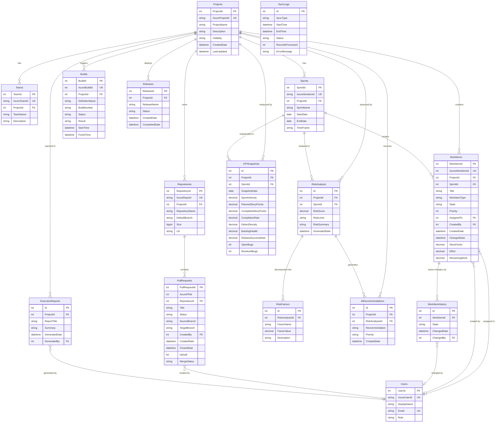

### 6.2 Relationship Summary Table

| Parent Table | Child Table | Cardinality | FK Column | Cascade |
|-------------|------------|-------------|-----------|---------|
| `Projects` | `Teams` | 1 : N | `Teams.ProjectId` | Restrict |
| `Projects` | `Sprints` | 1 : N | `Sprints.ProjectId` | Restrict |
| `Projects` | `WorkItems` | 1 : N | `WorkItems.ProjectId` | Restrict |
| `Projects` | `Repositories` | 1 : N | `Repositories.ProjectId` | Restrict |
| `Projects` | `Builds` | 1 : N | `Builds.ProjectId` | Restrict |
| `Projects` | `Releases` | 1 : N | `Releases.ProjectId` | Restrict |
| `Projects` | `KPISnapshots` | 1 : N | `KPISnapshots.ProjectId` | Restrict |
| `Projects` | `RiskAnalysis` | 1 : N | `RiskAnalysis.ProjectId` | Restrict |
| `Projects` | `AIRecommendations` | 1 : N | `AIRecommendations.ProjectId` | Restrict |
| `Projects` | `ExecutiveReports` | 1 : N | `ExecutiveReports.ProjectId` | Restrict |
| `Sprints` | `WorkItems` | 1 : N | `WorkItems.SprintId` | SetNull |
| `Sprints` | `KPISnapshots` | 1 : N | `KPISnapshots.SprintId` | Restrict |
| `Sprints` | `RiskAnalysis` | 1 : N | `RiskAnalysis.SprintId` | Restrict |
| `WorkItems` | `WorkItemHistory` | 1 : N | `WorkItemHistory.WorkItemId` | Cascade |
| `Users` | `WorkItems` (AssignedTo) | 0..1 : N | `WorkItems.AssignedTo` | SetNull |
| `Users` | `WorkItems` (CreatedBy) | 0..1 : N | `WorkItems.CreatedBy` | SetNull |
| `Users` | `WorkItemHistory` (ChangedBy) | 0..1 : N | `WorkItemHistory.ChangedBy` | SetNull |
| `Users` | `PullRequests` (CreatedBy) | 0..1 : N | `PullRequests.CreatedBy` | SetNull |
| `Users` | `ExecutiveReports` (GeneratedBy) | 1 : N | `ExecutiveReports.GeneratedBy` | Restrict |
| `Repositories` | `PullRequests` | 1 : N | `PullRequests.RepositoryId` | Restrict |
| `RiskAnalysis` | `RiskFactors` | 1 : N | `RiskFactors.RiskAnalysisId` | Cascade |
| `RiskAnalysis` | `AIRecommendations` | 1 : N | `AIRecommendations.RiskAnalysisId` | Cascade |

### 6.3 Indexes

| Table | Index | Columns | Type | Purpose |
|-------|-------|---------|------|---------|
| `Projects` | `IX_Projects_AzureProjectId` | `AzureProjectId` | UNIQUE | Upsert dedup |
| `Teams` | `IX_Teams_AzureTeamId` | `AzureTeamId` | UNIQUE | Upsert dedup |
| `Sprints` | `IX_Sprints_AzureIterationId` | `AzureIterationId` | UNIQUE | Upsert dedup |
| `WorkItems` | `IX_WorkItems_AzureWorkItemId` | `AzureWorkItemId` | UNIQUE | Upsert dedup |
| `WorkItems` | `IX_WorkItems_ProjectId_State` | `ProjectId`, `State` | Composite | KPI queries by state |
| `WorkItems` | `IX_WorkItems_SprintId` | `SprintId` | Standard | Sprint drill-down |
| `Repositories` | `IX_Repositories_AzureRepoId` | `AzureRepoId` | UNIQUE | Upsert dedup |
| `Builds` | `IX_Builds_AzureBuildId` | `AzureBuildId` | UNIQUE | Upsert dedup |
| `Users` | `IX_Users_AzureUserId` | `AzureUserId` | UNIQUE | Auth lookup |
| `Users` | `IX_Users_Email` | `Email` | UNIQUE | Auth lookup |
| `KPISnapshots` | `IX_KPI_ProjectId_SprintId_Date` | `ProjectId`, `SprintId`, `SnapshotDate` | UNIQUE | One snapshot per sprint per day |
| `RiskAnalysis` | `IX_Risk_ProjectId_GeneratedDate` | `ProjectId`, `GeneratedDate` | Standard | Latest risk lookup |
| `SyncLogs` | `IX_SyncLogs_StartTime` | `StartTime` | Standard | Retention cleanup query |

---

---

## 7. Repository Design

### 7.1 Generic Repository Base

All repositories inherit from a generic base class that provides standard CRUD operations via EF Core.

```
GenericRepository<T> : IGenericRepository<T>
  - AppDbContext _context
  + GetByIdAsync(int id)         → T?
  + GetAllAsync()                → List<T>
  + AddAsync(T entity)           → void
  + UpdateAsync(T entity)        → void
  + DeleteAsync(int id)          → void
  + SaveChangesAsync()           → void
```

### 7.2 Repository Method Contracts

#### `ProjectRepository`

| Method | Signature | Query Logic |
|--------|-----------|------------|
| `UpsertAsync` | `Task UpsertAsync(Project project)` | Find by `AzureProjectId`; insert if not found, update if found |
| `GetByIdAsync` | `Task<Project?> GetByIdAsync(int id)` | Find by `ProjectId`; include `Teams` and `Sprints` |
| `GetAllAsync` | `Task<List<Project>> GetAllAsync()` | All projects ordered by `ProjectName` |
| `GetAssignedToUserAsync` | `Task<List<Project>> GetAssignedToUserAsync(int userId)` | Filter via `ProjectAssignments` join table (Admin bypass: returns all) |

#### `SprintRepository`

| Method | Signature | Query Logic |
|--------|-----------|------------|
| `UpsertAsync` | `Task UpsertAsync(Sprint sprint)` | Find by `AzureIterationId`; insert or update |
| `GetByProjectAsync` | `Task<List<Sprint>> GetByProjectAsync(int projectId)` | Filter by `ProjectId`; order by `StartDate` desc |
| `GetActiveByProjectAsync` | `Task<Sprint?> GetActiveByProjectAsync(int projectId)` | Filter by `ProjectId` and `TimeFrame == Current` |
| `GetByIdAsync` | `Task<Sprint?> GetByIdAsync(int id)` | Find by `SprintId`; include `WorkItems` |

#### `WorkItemRepository`

| Method | Signature | Query Logic |
|--------|-----------|------------|
| `UpsertAsync` | `Task UpsertAsync(WorkItem workItem)` | Find by `AzureWorkItemId`; insert or update; never overwrite history |
| `AppendHistoryAsync` | `Task AppendHistoryAsync(WorkItemHistory history)` | Always INSERT — never update existing history records |
| `GetBySprintAsync` | `Task<List<WorkItem>> GetBySprintAsync(int sprintId)` | Filter by `SprintId`; include `AssignedUser` |
| `GetByProjectAsync` | `Task<List<WorkItem>> GetByProjectAsync(int projectId, WorkItemFilter filter)` | Filter by `ProjectId`; optional filter by `WorkItemType`, `State`, `AssignedTo` |
| `GetDelayedAsync` | `Task<List<WorkItem>> GetDelayedAsync(int sprintId, DateOnly endDate)` | Filter: `SprintId == sprintId AND State NOT IN (Resolved, Closed) AND EndDate < today` |
| `GetBugsByProjectAsync` | `Task<List<WorkItem>> GetBugsByProjectAsync(int projectId, int sprintId)` | Filter: `WorkItemType == Bug AND ProjectId AND SprintId` |

#### `KPISnapshotRepository`

| Method | Signature | Query Logic |
|--------|-----------|------------|
| `UpsertAsync` | `Task UpsertAsync(KPISnapshot snapshot)` | Find by `(ProjectId, SprintId, SnapshotDate)`; insert or update |
| `GetByProjectAsync` | `Task<List<KPISnapshot>> GetByProjectAsync(int projectId)` | All snapshots for project; order by `SnapshotDate` desc |
| `GetBySprintAsync` | `Task<KPISnapshot?> GetBySprintAsync(int sprintId)` | Most recent snapshot for sprint |
| `GetTrendAsync` | `Task<List<KPISnapshot>> GetTrendAsync(int projectId, int months)` | Filter by `ProjectId` and `SnapshotDate >= today - months` |

#### `RiskAnalysisRepository`

| Method | Signature | Query Logic |
|--------|-----------|------------|
| `InsertAsync` | `Task InsertAsync(RiskAnalysis analysis)` | Insert new record with `RiskFactors`; never overwrite previous analyses |
| `GetLatestByProjectAsync` | `Task<RiskAnalysis?> GetLatestByProjectAsync(int projectId)` | Filter by `ProjectId`; order by `GeneratedDate` desc; take 1; include `Factors` and `Recommendations` |
| `GetHistoryAsync` | `Task<List<RiskAnalysis>> GetHistoryAsync(int projectId)` | All analyses for project; order by `GeneratedDate` desc |
| `GetHighRiskProjectsAsync` | `Task<List<RiskAnalysis>> GetHighRiskProjectsAsync()` | Filter: `RiskLevel IN (High, Critical)` and most recent per project (BR-14) |

#### `AIRecommendationRepository`

| Method | Signature | Query Logic |
|--------|-----------|------------|
| `InsertAsync` | `Task InsertAsync(AIRecommendation rec)` | Insert new recommendation |
| `GetByRiskAnalysisAsync` | `Task<List<AIRecommendation>> GetByRiskAnalysisAsync(int riskAnalysisId)` | Filter by `RiskAnalysisId`; order by `Priority` |
| `GetByProjectAsync` | `Task<List<AIRecommendation>> GetByProjectAsync(int projectId)` | Most recent recommendations for project |

#### `ExecutiveReportRepository`

| Method | Signature | Query Logic |
|--------|-----------|------------|
| `InsertAsync` | `Task InsertAsync(ExecutiveReport report)` | Insert new report |
| `GetByProjectAsync` | `Task<List<ExecutiveReport>> GetByProjectAsync(int projectId)` | All reports for project; order by `GeneratedDate` desc |
| `GetByIdAsync` | `Task<ExecutiveReport?> GetByIdAsync(int id)` | Find by `Id`; include `GeneratedByUser` |

#### `SyncLogRepository`

| Method | Signature | Query Logic |
|--------|-----------|------------|
| `CreateAsync` | `Task<SyncLog> CreateAsync(SyncLog log)` | Insert new sync log entry; return with generated ID |
| `UpdateAsync` | `Task UpdateAsync(SyncLog log)` | Update `EndTime`, `Status`, `RecordsProcessed`, `ErrorMessage` |
| `GetRecentAsync` | `Task<List<SyncLog>> GetRecentAsync(int count)` | Most recent N sync logs; order by `StartTime` desc |
| `GetByStatusAsync` | `Task<List<SyncLog>> GetByStatusAsync(SyncStatus status)` | Filter by `Status` |

#### `AuditLogRepository`

| Method | Signature | Query Logic |
|--------|-----------|------------|
| `InsertAsync` | `Task InsertAsync(AuditLog log)` | Insert audit event record |
| `GetLogsAsync` | `Task<List<AuditLog>> GetLogsAsync(AuditLogFilter filter)` | Filter by `UserId`, `Action`, date range; paginated |
| `PurgeOldAsync` | `Task PurgeOldAsync()` | Delete records where `Timestamp < DateTime.UtcNow.AddDays(-90)` (NFR-25) |

### 7.3 Upsert Pattern

All sync repositories use a consistent upsert pattern to satisfy NFR-14 (no duplicates):

```
async Task UpsertAsync(TEntity entity)
  existing = await _context.Set<TEntity>()
    .FirstOrDefaultAsync(e => e.AzureId == entity.AzureId)

  if existing is null
    await _context.AddAsync(entity)
  else
    _context.Entry(existing).CurrentValues.SetValues(entity)

  await _context.SaveChangesAsync()
```

### 7.4 Repository–Table Mapping

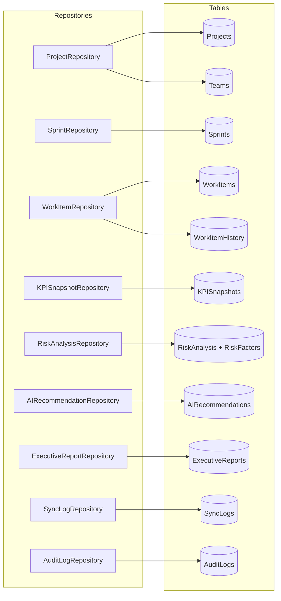

---

---

## 8. Service Design

### 8.1 ProjectService

**Interface:** `IProjectService`  
**Epic:** 1, 7

| Method | Signature | Logic |
|--------|-----------|-------|
| `GetAllAsync` | `Task<List<ProjectDto>> GetAllAsync(int userId, string role)` | If role == Admin → `GetAllAsync()`; if role == ProjectManager → `GetAssignedToUserAsync(userId)`; map to `ProjectDto` |
| `GetByIdAsync` | `Task<ProjectDto> GetByIdAsync(int projectId, int userId, string role)` | Fetch project; if PM and not assigned → throw `UnauthorizedProjectAccessException`; map to DTO |

**Dependencies:** `IProjectRepository`

---

### 8.2 SprintService

**Interface:** `ISprintService`  
**Epic:** 4

| Method | Signature | Logic |
|--------|-----------|-------|
| `GetByProjectAsync` | `Task<List<SprintDto>> GetByProjectAsync(int projectId)` | Fetch sprints; map `TimeFrame` enum; include date range |
| `GetSprintHealthAsync` | `Task<SprintHealthDto> GetSprintHealthAsync(int sprintId)` | Fetch sprint + latest `KPISnapshot`; apply BR-02 for status; calculate burndown data |
| `GetDelayedItemsAsync` | `Task<List<WorkItemDto>> GetDelayedItemsAsync(int sprintId)` | Call `WorkItemRepository.GetDelayedAsync(sprintId, sprint.EndDate)`; map to DTO; flag `IsDelayed = true` |

**Dependencies:** `ISprintRepository`, `IWorkItemRepository`, `IKPISnapshotRepository`

---

### 8.3 WorkItemService

**Interface:** `IWorkItemService`  
**Epic:** 4

| Method | Signature | Logic |
|--------|-----------|-------|
| `GetBySprintAsync` | `Task<List<WorkItemDto>> GetBySprintAsync(int sprintId)` | Fetch work items; map type, state, story points; include assigned user display name |
| `GetByProjectAsync` | `Task<List<WorkItemDto>> GetByProjectAsync(int projectId, WorkItemFilter filter)` | Delegate to repository with optional filter; paginate; map to DTO |

**Dependencies:** `IWorkItemRepository`

---

### 8.4 KPIEngine

**Interface:** `IKPIEngine`  
**Epic:** 3

| Method | Signature | Logic |
|--------|-----------|-------|
| `CalculateAsync` | `Task<KPISnapshotDto> CalculateAsync(int projectId, int sprintId)` | See §12 for full algorithm |
| `CalculateAllAsync` | `Task<List<KPISnapshotDto>> CalculateAllAsync(int projectId)` | Get all sprints for project; run `CalculateAsync` per sprint; batch upsert |
| `GetTrendAsync` | `Task<List<KPISnapshotDto>> GetTrendAsync(int projectId)` | Fetch from `KPISnapshotRepository.GetTrendAsync(projectId, 24)`; map to DTO; compute trend direction (up/down/flat) |

**Dependencies:** `IWorkItemRepository`, `ISprintRepository`, `IBuildRepository`, `IKPISnapshotRepository`

---

### 8.5 AIRiskEngine

**Interface:** `IAIRiskEngine`  
**Epic:** 5

| Method | Signature | Logic |
|--------|-----------|-------|
| `AnalyseRiskAsync` | `Task<RiskAnalysisDto> AnalyseRiskAsync(int projectId, int sprintId)` | See §13 for full algorithm |
| `GetLatestRiskAsync` | `Task<RiskAnalysisDto> GetLatestRiskAsync(int projectId)` | Fetch from `RiskAnalysisRepository.GetLatestByProjectAsync`; map to DTO with `IsAIGenerated = true` |
| `GetHighRiskProjectsAsync` | `Task<List<RiskAnalysisDto>> GetHighRiskProjectsAsync()` | Fetch from `RiskAnalysisRepository.GetHighRiskProjectsAsync()`; used for governance dashboard (BR-14) |

**Dependencies:** `IKPISnapshotRepository`, `IRiskAnalysisRepository`, `IAIRecommendationRepository`, `IOpenAIClient`, `IAuditLogService`

---

### 8.6 AIReportEngine

**Interface:** `IAIReportEngine`  
**Epic:** 6

| Method | Signature | Logic |
|--------|-----------|-------|
| `GenerateReportAsync` | `Task<ExecutiveReportDto> GenerateReportAsync(int projectId, ReportPeriod period)` | Fetch KPI history + risk analyses for period; build executive prompt; call `IOpenAIClient`; validate response non-empty; persist `ExecutiveReport`; return DTO with `IsAIGenerated = true` |
| `GetReportsAsync` | `Task<List<ExecutiveReportDto>> GetReportsAsync(int projectId)` | Fetch from `ExecutiveReportRepository.GetByProjectAsync`; map to DTO |
| `GetByIdAsync` | `Task<ExecutiveReportDto> GetByIdAsync(int reportId)` | Fetch by ID; include generated-by user name |

**Dependencies:** `IKPISnapshotRepository`, `IRiskAnalysisRepository`, `IExecutiveReportRepository`, `IOpenAIClient`, `IAuditLogService`

---

### 8.7 SyncOrchestrator

**Interface:** `ISyncOrchestrator`  
**Epic:** 1

| Method | Signature | Logic |
|--------|-----------|-------|
| `RunFullSyncAsync` | `Task RunFullSyncAsync()` | See §10 Background Services for full sequence |
| `GetSyncStatusAsync` | `Task<SyncStatusDto> GetSyncStatusAsync()` | Fetch last 5 sync logs; return latest status + timestamp + record count |

**Dependencies:** `IAzureDevOpsClient`, all entity repositories, `ISyncLogRepository`, `IKPIEngine`, `IAIRiskEngine`

---

### 8.8 AuditLogService

**Interface:** `IAuditLogService`  
**Epic:** 2

| Method | Signature | Logic |
|--------|-----------|-------|
| `LogAsync` | `Task LogAsync(int userId, string action, string resource, string? details)` | Create `AuditLog` record with `Timestamp = UtcNow`; persist via `IAuditLogRepository` |
| `GetLogsAsync` | `Task<List<AuditLogDto>> GetLogsAsync(AuditLogFilter filter)` | Delegate to repository with filter (userId, action, date range); paginate; map to DTO |
| `PurgeOldLogsAsync` | `Task PurgeOldLogsAsync()` | Call `AuditLogRepository.PurgeOldAsync()` — deletes records older than 90 days (NFR-25) |

**Dependencies:** `IAuditLogRepository`

---

### 8.9 Service Dependency Graph

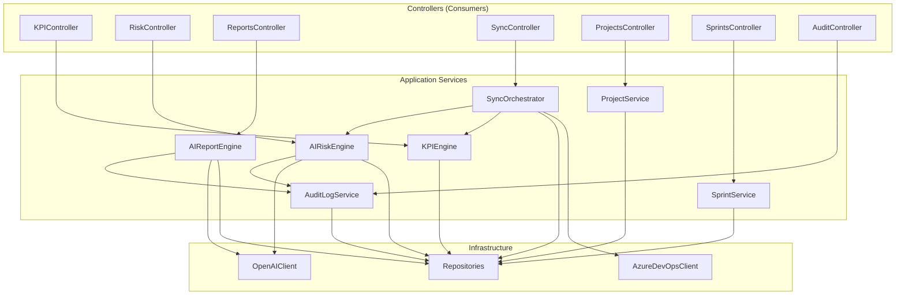

---

---

## 9. API Specifications

All endpoints require `Authorization: Bearer <JWT>` unless marked public.  
All responses follow the standard envelope: `{ "data": ..., "error": null }` on success, `{ "data": null, "error": { "code": "...", "message": "..." } }` on failure.

### 9.1 Auth Endpoints

| Method | Path | Auth | Role | Request | Response | Description |
|--------|------|------|------|---------|----------|-------------|
| `GET` | `/api/auth/me` | Required | Any | — | `UserProfileDto` | Returns current user's ID, display name, email, role |
| `POST` | `/api/auth/logout` | Required | Any | — | `204 No Content` | Clears server-side session references |

---

### 9.2 Projects Endpoints

| Method | Path | Auth | Role | Request | Response | Description |
|--------|------|------|------|---------|----------|-------------|
| `GET` | `/api/projects` | Required | Admin, PM | — | `List<ProjectDto>` | Admin: all projects. PM: assigned projects only (BR-07) |
| `GET` | `/api/projects/{id}` | Required | Admin, PM | — | `ProjectDto` | Project detail; PM access validated against assignment |
| `GET` | `/api/projects/{id}/summary` | Required | Admin, PM | — | `ProjectSummaryDto` | Project name, health status, latest KPI summary, latest risk level |

**`ProjectDto`**
```json
{
  "projectId": 1,
  "projectName": "Platform Revamp",
  "description": "...",
  "visibility": "Private",
  "createdDate": "2025-01-10T00:00:00Z",
  "lastUpdated": "2026-07-14T08:00:00Z"
}
```

---

### 9.3 Sprints Endpoints

| Method | Path | Auth | Role | Request | Response | Description |
|--------|------|------|------|---------|----------|-------------|
| `GET` | `/api/projects/{id}/sprints` | Required | Admin, PM | — | `List<SprintDto>` | All sprints for project ordered by start date |
| `GET` | `/api/projects/{id}/sprints/active` | Required | Admin, PM | — | `SprintDto` | Current active sprint |
| `GET` | `/api/projects/{id}/sprints/{sprintId}/health` | Required | Admin, PM | — | `SprintHealthDto` | Completion rate, burndown, status (At Risk / On Track) |
| `GET` | `/api/projects/{id}/sprints/{sprintId}/workitems` | Required | Admin, PM | `?type=Bug&state=Active` | `List<WorkItemDto>` | Work items for sprint with optional filters |
| `GET` | `/api/projects/{id}/sprints/{sprintId}/delayed` | Required | Admin, PM | — | `List<WorkItemDto>` | Work items past end date and not closed (BR-05) |

**`SprintHealthDto`**
```json
{
  "sprintId": 12,
  "sprintName": "Sprint 5",
  "startDate": "2026-07-01",
  "endDate": "2026-07-14",
  "timeFrame": "Current",
  "plannedStoryPoints": 40.0,
  "completedStoryPoints": 28.0,
  "completionRate": 70.0,
  "sprintStatus": "At Risk",
  "delayedItemCount": 3,
  "burndownData": [{ "date": "2026-07-01", "remaining": 40.0 }, ...]
}
```

---

### 9.4 KPI Endpoints

| Method | Path | Auth | Role | Request | Response | Description |
|--------|------|------|------|---------|----------|-------------|
| `GET` | `/api/projects/{id}/kpi` | Required | Admin, PM | `?months=12` | `List<KPISnapshotDto>` | KPI trend history for project (default 12 months) |
| `GET` | `/api/projects/{id}/kpi/latest` | Required | Admin, PM | — | `KPISnapshotDto` | Most recent KPI snapshot |
| `GET` | `/api/projects/{id}/sprints/{sprintId}/kpi` | Required | Admin, PM | — | `KPISnapshotDto` | KPI snapshot for specific sprint |
| `POST` | `/api/projects/{id}/kpi/calculate` | Required | Admin, ITAdmin | — | `KPISnapshotDto` | Trigger manual KPI recalculation for project |

**`KPISnapshotDto`**
```json
{
  "projectId": 1,
  "sprintId": 12,
  "sprintName": "Sprint 5",
  "snapshotDate": "2026-07-14",
  "sprintVelocity": 28.0,
  "plannedStoryPoints": 40.0,
  "completedStoryPoints": 28.0,
  "completionRate": 70.0,
  "defectDensity": 0.14,
  "backlogHealth": 78.5,
  "releaseSuccessRate": 85.0,
  "openBugs": 4,
  "resolvedBugs": 10,
  "sprintStatus": "At Risk",
  "backlogClassification": "Moderate"
}
```

---

### 9.5 Risk Analysis Endpoints

| Method | Path | Auth | Role | Request | Response | Description |
|--------|------|------|------|---------|----------|-------------|
| `GET` | `/api/projects/{id}/risk` | Required | Admin, PM | — | `RiskAnalysisDto` | Latest AI risk analysis for project |
| `GET` | `/api/projects/{id}/risk/history` | Required | Admin, PM | — | `List<RiskAnalysisDto>` | All past risk assessments |
| `POST` | `/api/projects/{id}/risk/analyse` | Required | Admin, PM | — | `RiskAnalysisDto` | Trigger manual AI risk re-analysis |
| `GET` | `/api/risk/high` | Required | Admin | — | `List<RiskAnalysisDto>` | All High/Critical risk projects (BR-14) |

**`RiskAnalysisDto`**
```json
{
  "id": 45,
  "projectId": 1,
  "riskScore": 72.5,
  "riskLevel": "High",
  "riskSummary": "Sprint completion rate has declined...",
  "generatedDate": "2026-07-14T09:30:00Z",
  "isAIGenerated": true,
  "factors": [
    { "factorName": "CompletionRate", "factorValue": 70.0, "description": "Below 80% threshold" }
  ],
  "recommendations": [
    { "recommendation": "Review sprint backlog sizing", "priority": "High" }
  ]
}
```

---

### 9.6 Executive Reports Endpoints

| Method | Path | Auth | Role | Request | Response | Description |
|--------|------|------|------|---------|----------|-------------|
| `POST` | `/api/reports/generate` | Required | Admin, PM | `GenerateReportRequest` | `ExecutiveReportDto` | Trigger AI executive report generation |
| `GET` | `/api/reports` | Required | Admin, PM | `?projectId=1` | `List<ExecutiveReportDto>` | All reports; filtered by project for PM |
| `GET` | `/api/reports/{id}` | Required | Admin, PM | — | `ExecutiveReportDto` | Full report content by ID |

**`GenerateReportRequest`**
```json
{
  "projectId": 1,
  "periodMonths": 3,
  "reportTitle": "Q2 2026 Delivery Report"
}
```

**`ExecutiveReportDto`**
```json
{
  "id": 7,
  "projectId": 1,
  "reportTitle": "Q2 2026 Delivery Report",
  "summary": "## Executive Summary\n\nDuring Q2 2026...",
  "generatedDate": "2026-07-14T10:00:00Z",
  "generatedByName": "Jane Smith",
  "isAIGenerated": true
}
```

---

### 9.7 Sync Endpoints

| Method | Path | Auth | Role | Request | Response | Description |
|--------|------|------|------|---------|----------|-------------|
| `POST` | `/api/sync/trigger` | Required | Admin, ITAdmin | — | `SyncStatusDto` | Trigger manual Azure DevOps synchronisation |
| `GET` | `/api/sync/status` | Required | Admin, ITAdmin | — | `SyncStatusDto` | Latest sync status and last 5 sync logs |

**`SyncStatusDto`**
```json
{
  "lastSyncTime": "2026-07-14T06:00:00Z",
  "status": "Completed",
  "recordsProcessed": 342,
  "recentLogs": [
    { "syncType": "Full", "startTime": "...", "endTime": "...", "status": "Completed", "recordsProcessed": 342 }
  ]
}
```

---

### 9.8 Audit Endpoints

| Method | Path | Auth | Role | Request | Response | Description |
|--------|------|------|------|---------|----------|-------------|
| `GET` | `/api/audit/logs` | Required | Admin, ITAdmin | `?userId=&action=&from=&to=&page=1&pageSize=50` | `PagedResult<AuditLogDto>` | Query audit logs with filters (NFR-23) |

---

### 9.9 Dashboard Endpoint

| Method | Path | Auth | Role | Request | Response | Description |
|--------|------|------|------|---------|----------|-------------|
| `GET` | `/api/dashboard` | Required | Any | — | `DashboardDto` | Aggregated dashboard data: project list, recent KPIs, high-risk projects — role-filtered |

---

### 9.10 Standard Error Responses

| HTTP Status | Code | Scenario |
|-------------|------|---------|
| `400 Bad Request` | `VALIDATION_ERROR` | Invalid request body or query parameter |
| `401 Unauthorized` | `UNAUTHENTICATED` | Missing or expired JWT token |
| `403 Forbidden` | `UNAUTHORIZED` | Valid token but insufficient role or project access |
| `404 Not Found` | `NOT_FOUND` | Resource does not exist |
| `500 Internal Server Error` | `INTERNAL_ERROR` | Unhandled exception (details suppressed in production) |
| `503 Service Unavailable` | `AI_UNAVAILABLE` | Azure OpenAI request failed after retries |

---

---

## 10. Background Services

### 10.1 SyncHostedService

**Type:** `IHostedService` / `BackgroundService`  
**Project:** `SarathiAI.Infrastructure/BackgroundServices/SyncHostedService.cs`  
**Epic:** 1

#### Responsibilities

- Runs on a configurable schedule (default: every 6 hours)
- Supports on-demand trigger via `ISyncOrchestrator.RunFullSyncAsync()` called from `SyncController`
- Executes the full Azure DevOps sync pipeline
- Chains KPI calculation and AI risk analysis as post-sync steps
- Retries on failure up to 3 times with exponential back-off (NFR-12)
- Isolates AI failures so they do not block sync or dashboard (NFR-30)

#### Execution Flow

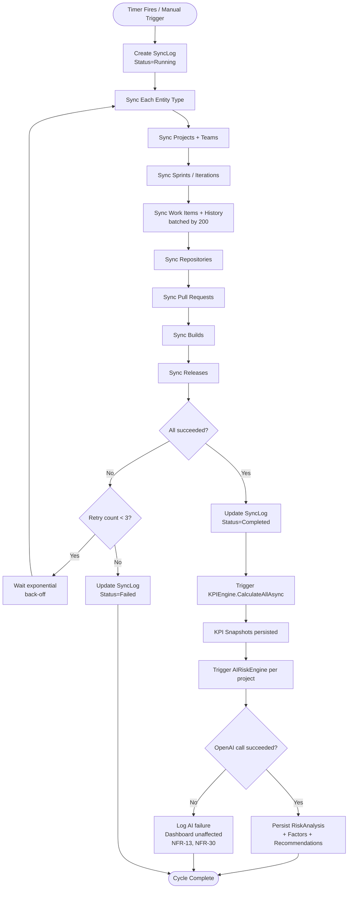

#### Schedule Configuration

```json
"SyncSettings": {
  "CronSchedule": "0 */6 * * *",
  "BatchSize": 200,
  "MaxRetryAttempts": 3,
  "RetryBackoffSeconds": [30, 120, 300]
}
```

#### Retry Policy

| Attempt | Wait Before Retry |
|---------|-----------------|
| 1st retry | 30 seconds |
| 2nd retry | 2 minutes |
| 3rd retry | 5 minutes |
| After 3rd failure | Log `SyncStatus=Failed`; raise admin alert (NFR-15) |

### 10.2 AuditLogPurgeHostedService

**Type:** `IHostedService`  
**Project:** `SarathiAI.Infrastructure/BackgroundServices/AuditLogPurgeHostedService.cs`

#### Responsibilities

- Runs once daily at midnight UTC
- Calls `IAuditLogService.PurgeOldLogsAsync()` to delete audit records older than 90 days (NFR-25, BR-10)

#### Execution Flow

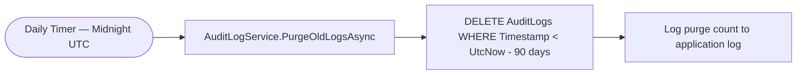

### 10.3 Hosted Service Registration

All background services are registered in `Program.cs` via `ServiceCollectionExtensions`:

```
builder.Services.AddHostedService<SyncHostedService>()
builder.Services.AddHostedService<AuditLogPurgeHostedService>()
```

### 10.4 Azure DevOps Sync — Entity Batch Sizes

| Entity | Batch Strategy | Notes |
|--------|---------------|-------|
| Projects | Single request — all projects | Typically < 100 projects per org |
| Teams | Per-project request | One API call per project |
| Sprints | Per-project/team request | One call per team |
| Work Items | WIQL query + batch fetch (200 per call) | Work items fetched in batches of 200 to respect API limits |
| Work Item History | Per work item (only items changed since last sync) | Uses `ChangedDate > lastSyncTime` filter |
| Repositories | Per-project request | — |
| Pull Requests | Per-repository request, paged | 100 per page |
| Builds | Per-project request, filtered by last sync date | — |
| Releases | Per-project request, filtered by last sync date | — |

### 10.5 Incremental Sync Strategy

To minimise Azure DevOps API consumption:

1. `SyncOrchestrator` records `lastSyncTime` from the most recent successful `SyncLog.EndTime`
2. Work items fetched using WIQL filter: `[ChangedDate] >= @lastSyncTime`
3. Work item history fetched only for work items updated since last sync
4. Builds and releases filtered by `finishTime >= lastSyncTime`
5. Full sync triggered when no previous successful sync exists

---

---

## 11. Authentication & Authorization Flow

### 11.1 Authentication Architecture

| Component | Technology | Responsibility |
|-----------|-----------|---------------|
| **Identity Provider** | Microsoft Entra ID | Issues JWT access tokens and ID tokens via OAuth 2.0 / OIDC |
| **Frontend Auth** | `@azure/msal-browser` + `@azure/msal-react` | Handles PKCE flow, token acquisition, silent refresh, logout |
| **Backend Auth** | `Microsoft.Identity.Web` | Validates JWT — signature, issuer, audience, expiry, role claims |
| **RBAC** | ASP.NET Core Policy-based auth | Maps role claims to endpoint permissions |
| **Audit** | `AuditLogService` | Records every login, logout, and admin action |

### 11.2 Full Login Flow (PKCE)

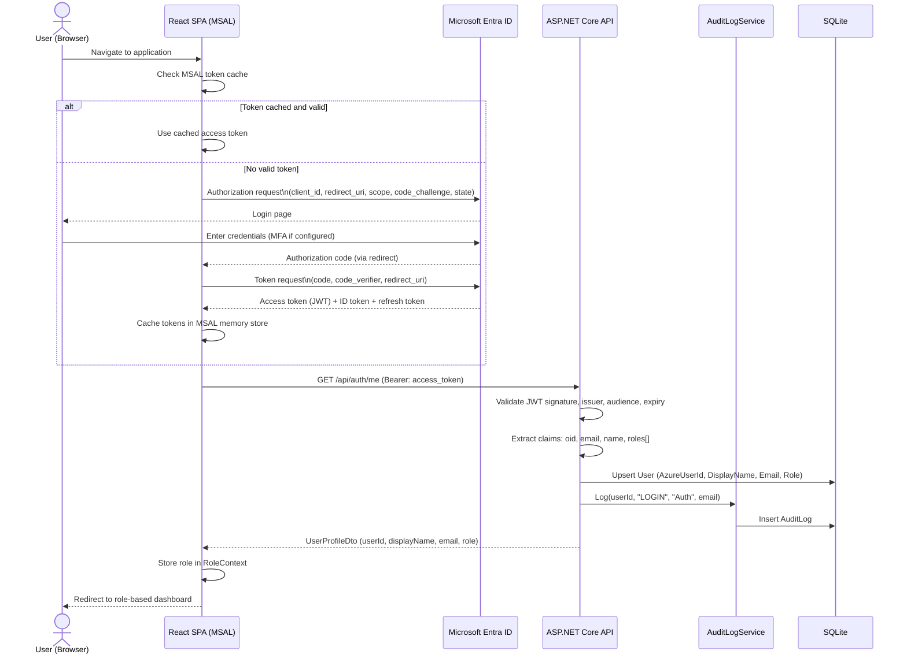

### 11.3 API Request Authorization Flow

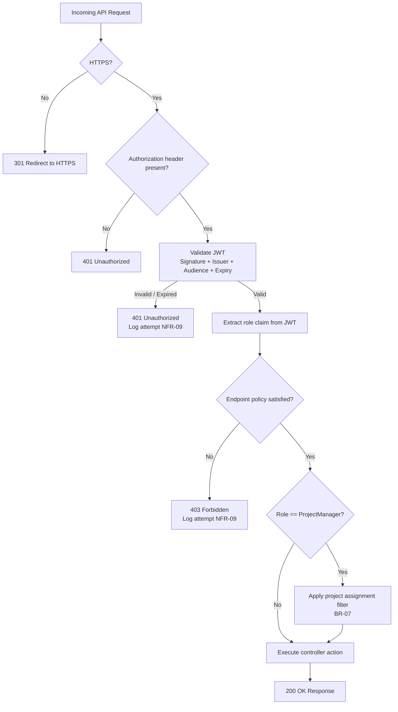

### 11.4 Role Definitions & Entra ID App Roles

Roles are defined as **App Roles** in the Entra ID Application Registration and assigned to users in the Entra ID portal.

| App Role Name | Display Name | Description | BRD Reference |
|---------------|-------------|-------------|--------------|
| `Administrator` | Administrator | Full access to all projects, dashboards, reports, and governance | BR-06 |
| `ProjectManager` | Project Manager | Access to assigned projects only; KPI, sprint, risk, and reports | BR-07 |
| `ITAdmin` | IT Admin | Platform config, sync management, audit logs, application health | BR-08 |

### 11.5 JWT Token Structure

```json
{
  "aud": "api://sarathi-ai-api",
  "iss": "https://login.microsoftonline.com/{tenantId}/v2.0",
  "iat": 1720000000,
  "exp": 1720003600,
  "oid": "user-object-id",
  "preferred_username": "jane.smith@org.com",
  "name": "Jane Smith",
  "roles": ["ProjectManager"],
  "tid": "tenant-id"
}
```

**Claims used by backend:**

| Claim | C# Property | Usage |
|-------|------------|-------|
| `oid` | `User.FindFirst("oid")` | Match to `Users.AzureUserId` for DB lookup |
| `preferred_username` | `User.FindFirst("preferred_username")` | Email for audit logging |
| `name` | `User.FindFirst("name")` | Display name |
| `roles` | `User.IsInRole("Administrator")` | RBAC policy enforcement |

### 11.6 RBAC Policy Definitions

Policies registered in `Program.cs` via `AuthExtensions.cs`:

| Policy Name | Roles Allowed | Applied To |
|-------------|-------------|-----------|
| `"AdminOnly"` | Administrator | Org-wide project list, high-risk dashboard, sync trigger |
| `"AdminOrPM"` | Administrator, ProjectManager | Project detail, KPI, sprint, risk, reports |
| `"AdminOrITAdmin"` | Administrator, ITAdmin | Sync management, audit logs, user management |
| `"AnyRole"` | All authenticated roles | `/api/auth/me`, `/api/dashboard` |

### 11.7 Token Refresh & Session Expiry

| Scenario | Behaviour |
|----------|-----------|
| Access token expires (typically 1 hour) | MSAL silently acquires new token using refresh token |
| User idle for 30 minutes | Frontend detects inactivity; calls `msalInstance.logoutRedirect()` (NFR-10) |
| Refresh token expired | MSAL triggers interactive login redirect |
| User clicks Logout | MSAL `logoutRedirect()` called; `POST /api/auth/logout` called; audit log written |

### 11.8 User Upsert on First Login

On every successful token validation, the backend upserts the user record:

```
User? existing = await _userRepository.GetByAzureIdAsync(oid)

if existing is null
  INSERT Users (AzureUserId=oid, DisplayName=name, Email=email, Role=roles[0])
else
  UPDATE Users SET DisplayName=name, Email=email, Role=roles[0] WHERE AzureUserId=oid
```

This ensures the local `Users` table stays in sync with Entra ID without a separate provisioning step.

---

---

## 12. KPI Engine Design

### 12.1 Overview

The `KPIEngine` is an Application-layer service responsible for computing all delivery KPIs defined in BRD §7 and §13. It reads raw work item, sprint, and build data from the database and produces a `KPISnapshot` record for each sprint. Snapshots are pre-computed so dashboards load from cache without recalculating (NFR-01).

**Triggered by:**
- `SyncHostedService` automatically after each successful sync (NFR-03: < 5 minutes)
- `POST /api/projects/{id}/kpi/calculate` for manual recalculation

### 12.2 KPI Calculation Flow

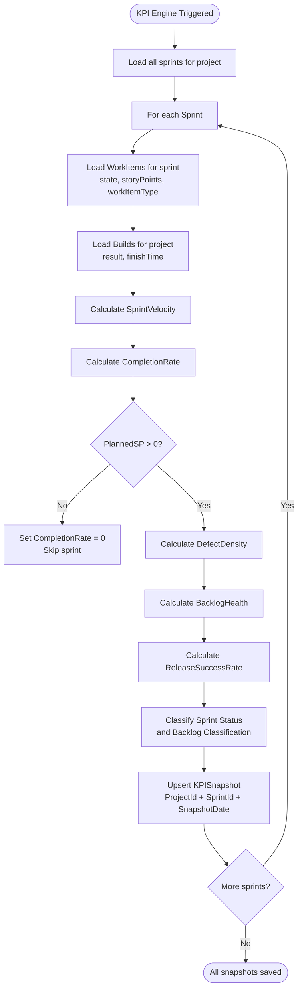

### 12.3 KPI Formulas & Algorithms

#### Sprint Velocity (FR-3.1)

```
SprintVelocity = SUM(StoryPoints WHERE State IN (Resolved, Closed))
```

- Only counts story points from work items with terminal states
- Work item types included: `UserStory`, `Task`, `Feature`
- `Bug` work items excluded from velocity (counted separately as defects)

#### Sprint Completion Rate (FR-3.2, BR-01, BR-02)

```
PlannedStoryPoints = SUM(StoryPoints for all WorkItems assigned to sprint)
CompletedStoryPoints = SUM(StoryPoints WHERE State IN (Resolved, Closed))

CompletionRate = (CompletedStoryPoints / PlannedStoryPoints) × 100

SprintStatus = CompletionRate < 80 ? "At Risk" : "On Track"  // BR-02
```

#### Defect Density (FR-3.3, BR-03)

```
TotalDefects = COUNT(WorkItems WHERE WorkItemType == Bug AND SprintId == currentSprint)

DefectDensity = TotalDefects / CompletedStoryPoints

// Guard: if CompletedStoryPoints == 0 → DefectDensity = 0
```

#### Backlog Health (FR-3.4, BR-04)

```
TotalBacklogItems = COUNT(WorkItems WHERE State NOT IN (Resolved, Closed, Removed)
                          AND SprintId IS NULL)  // unassigned backlog

ReadyItems = COUNT(backlog items WHERE StoryPoints IS NOT NULL
                   AND Priority IS NOT NULL
                   AND Title IS NOT NULL)

BacklogHealth = (ReadyItems / TotalBacklogItems) × 100

Classification:
  BacklogHealth > 85  → "Healthy"
  BacklogHealth 70–85 → "Moderate"
  BacklogHealth < 70  → "Poor"
```

#### Story Completion Trend (FR-3.5)

```
For each of the last N sprints (default 12):
  CompletionRate[i] = calculated per sprint

TrendDirection:
  last3Avg = AVG(CompletionRate[last 3 sprints])
  prev3Avg = AVG(CompletionRate[sprints 4-6])
  Trend = last3Avg > prev3Avg + 5  → "Improving"
        = last3Avg < prev3Avg - 5  → "Declining"
        = else                     → "Stable"
```

#### Release Success Rate (FR-3.6)

```
TotalBuilds     = COUNT(Builds WHERE ProjectId == project AND FinishTime in sprint range)
SucceededBuilds = COUNT(Builds WHERE Result == "Succeeded" AND same filter)

ReleaseSuccessRate = (SucceededBuilds / TotalBuilds) × 100

// Guard: if TotalBuilds == 0 → ReleaseSuccessRate = 100 (no failed builds)
```

#### Open / Resolved Bugs

```
OpenBugs     = COUNT(WorkItems WHERE WorkItemType == Bug
                     AND State NOT IN (Resolved, Closed)
                     AND ProjectId == project)

ResolvedBugs = COUNT(WorkItems WHERE WorkItemType == Bug
                     AND State IN (Resolved, Closed)
                     AND SprintId == currentSprint)
```

### 12.4 KPI Engine Class Diagram

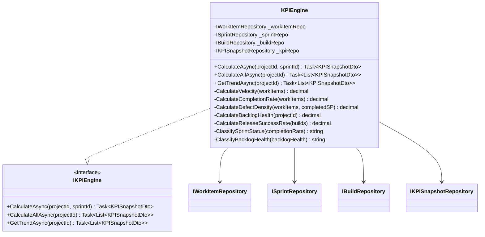

### 12.5 KPI Threshold Reference (Business Rules)

| KPI | Threshold | Classification | Rule |
|-----|-----------|---------------|------|
| Sprint Completion Rate | < 80% | At Risk | BR-02 |
| Sprint Completion Rate | ≥ 80% | On Track | BR-02 |
| Backlog Health | > 85% | Healthy | BR-04 |
| Backlog Health | 70–85% | Moderate | BR-04 |
| Backlog Health | < 70% | Poor | BR-04 |
| Project Delayed | > 20% remaining after sprint close | Delayed | BR-05 |
| Defect Density | No hard threshold — used as risk input | — | BR-03 |

### 12.6 KPI Trend Analysis (FR-3.7)

Each `KPISnapshotDto` returned by `GetTrendAsync` includes a computed `trendDirection` field:

| Field | Values | Calculation |
|-------|--------|------------|
| `completionRateTrend` | `Improving`, `Stable`, `Declining` | Avg last 3 vs prev 3 sprints, ±5% threshold |
| `velocityTrend` | `Improving`, `Stable`, `Declining` | Avg last 3 vs prev 3 sprint velocities |
| `defectTrend` | `Improving`, `Stable`, `Worsening` | Avg last 3 vs prev 3 defect densities (lower = improving) |

---

---

## 13. AI Engine Design

### 13.1 Overview

The AI layer consists of two engines sharing a common `IOpenAIClient` infrastructure:

| Engine | Epic | Purpose |
|--------|------|---------|
| `AIRiskEngine` | Epic 5 | Analyses KPI snapshots → returns risk score, factors, recommendations |
| `AIReportEngine` | Epic 6 | Transforms KPI + risk data → returns executive narrative summary |

Both engines:
- Send only DB-persisted synchronized data to Azure OpenAI (NFR-32)
- Label all outputs as AI-generated (NFR-29, `isAIGenerated = true`)
- Log all requests and responses for audit (NFR-33)
- Fail gracefully — AI failures do not impact dashboard availability (NFR-30)

### 13.2 OpenAI Client Design

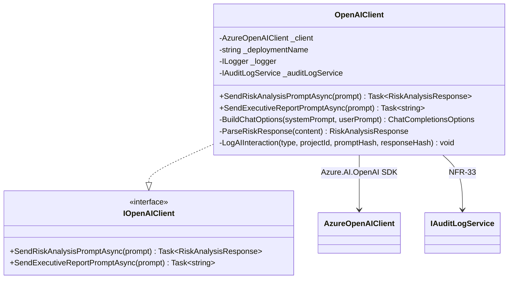

**Retry policy** (`Polly`):
- 3 retries on `HttpRequestException` or `RequestFailedException`
- Exponential back-off: 2s, 4s, 8s
- On final failure: throw `AIProcessingException`; caller catches and isolates (NFR-30)

### 13.3 AI Risk Engine — Detailed Flow

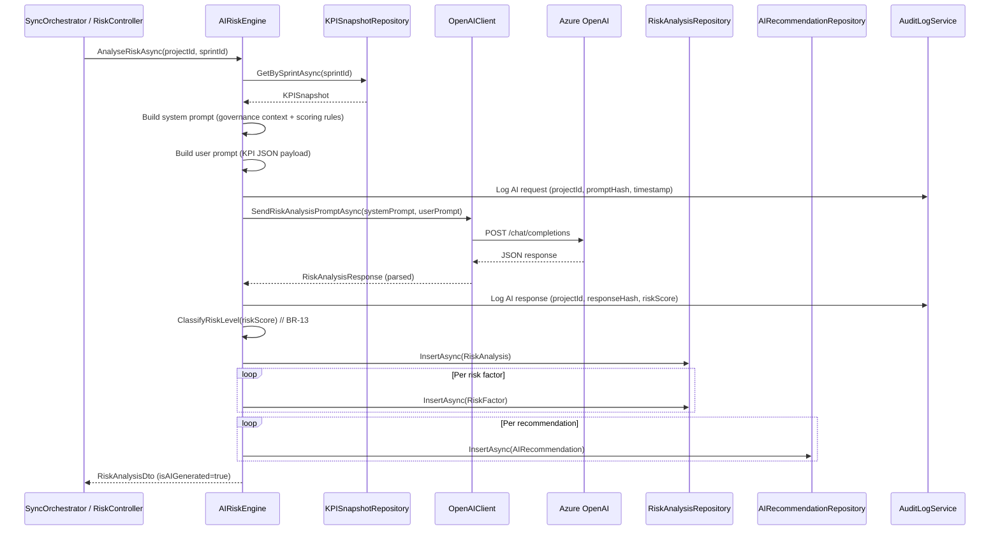

### 13.4 Risk Analysis Prompt Design

#### System Prompt
```
You are a delivery governance analyst for a software project management platform.
Your task is to evaluate delivery health based on KPI metrics and return a
structured JSON risk assessment.

Risk scoring rules:
- Score 0–30: Low risk — delivery is on track
- Score 31–60: Medium risk — some concerns, monitor closely
- Score 61–80: High risk — significant delivery risk, intervention recommended
- Score 81–100: Critical risk — immediate action required

You must return ONLY valid JSON in this exact format:
{
  "riskScore": <number 0-100>,
  "riskLevel": "<Low|Medium|High|Critical>",
  "riskSummary": "<2-3 sentence narrative>",
  "factors": [
    { "factorName": "<name>", "factorValue": <number>, "description": "<explanation>" }
  ],
  "recommendations": [
    { "recommendation": "<action>", "priority": "<Low|Medium|High|Critical>" }
  ]
}
```

#### User Prompt Template
```
Analyse the delivery health for the following sprint:

Project: {projectName}
Sprint: {sprintName} ({startDate} to {endDate})

KPI Metrics:
- Sprint Completion Rate: {completionRate}% (threshold: 80%)
- Sprint Velocity: {velocity} story points
- Defect Density: {defectDensity} defects per story point
- Backlog Health: {backlogHealth}% ({backlogClassification})
- Release Success Rate: {releaseSuccessRate}%
- Open Bugs: {openBugs}
- Resolved Bugs: {resolvedBugs}

Previous sprint completion rate: {prevCompletionRate}%
Trend direction: {trendDirection}
```

### 13.5 AI Report Engine — Detailed Flow

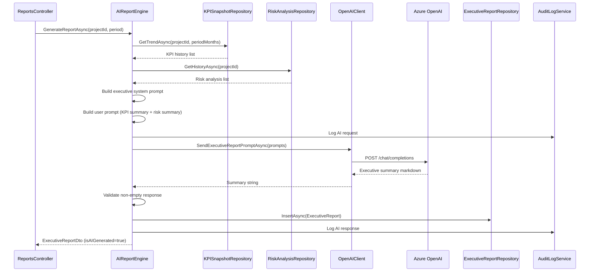

### 13.6 Executive Report Prompt Design

#### System Prompt
```
You are an executive delivery intelligence assistant. Your role is to generate
clear, professional executive summaries of software project delivery performance
for project managers and senior leadership.

Write in formal business language. Structure using markdown headings.
Base your summary ONLY on the data provided — do not invent metrics or trends.
Clearly indicate this is an AI-generated report.
```

#### User Prompt Template
```
Generate an executive delivery report for:

Project: {projectName}
Report Period: {startDate} to {endDate}

KPI Summary (last {N} sprints):
| Sprint | Completion Rate | Velocity | Defect Density | Backlog Health |
|--------|----------------|----------|---------------|----------------|
{kpiTable}

Risk Assessment:
- Latest Risk Score: {riskScore} ({riskLevel})
- Risk Summary: {riskSummary}

Top Recommendations:
{recommendations}

Please provide:
1. Executive Summary (3-4 sentences)
2. Delivery Performance Analysis
3. Risk Overview
4. Key Recommendations
5. Outlook
```

### 13.7 AI Engine Class Diagram

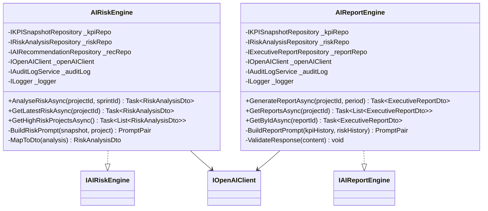

### 13.8 AI Governance Controls

| Requirement | Implementation |
|-------------|---------------|
| NFR-29 — AI label | All DTOs carry `isAIGenerated = true`; SPA renders `<AIBadge>` component |
| NFR-30 — Failure isolation | `try/catch AIProcessingException` in `SyncOrchestrator`; dashboard renders from pre-computed snapshots |
| NFR-31 — Traceability | `AIRecommendations.RiskAnalysisId` → `RiskAnalysis.SprintId` → `KPISnapshots` |
| NFR-32 — Data boundary | Prompts built exclusively from DB records — no user-supplied free text |
| NFR-33 — AI audit log | `OpenAIClient` logs `(type, projectId, promptHash, responseHash, timestamp)` per interaction |

---

---

## 14. Algorithms & Business Logic

### 14.1 Sprint Health Evaluation Algorithm

Executed by `SprintService.GetSprintHealthAsync()` after KPI calculation.

```mermaid
flowchart TD
  INPUT([Input: SprintId]) --> LOAD[Load Sprint + KPISnapshot]
  LOAD --> CR{CompletionRate < 80%?}
  CR -->|Yes| AT_RISK[SprintStatus = At Risk]
  CR -->|No| ON_TRACK[SprintStatus = On Track]

  AT_RISK --> CHECK_DELAY{EndDate < Today\nAND CompletionRate < 80%?}
  ON_TRACK --> CHECK_DELAY

  CHECK_DELAY -->|Yes| DELAYED[Project flagged as Delayed\nBR-05]
  CHECK_DELAY -->|No| BURNDOWN[Calculate Burndown Data]
  DELAYED --> BURNDOWN

  BURNDOWN --> LOOP[For each day in sprint]
  LOOP --> POINTS[RemainingPoints[day] =\nTotalSP - SUM completed before day]
  POINTS --> IDEAL[IdealBurndown[day] =\nTotalSP × (1 - dayIndex/totalDays)]
  IDEAL --> NEXT{More days?}
  NEXT -->|Yes| LOOP
  NEXT -->|No| RETURN([Return SprintHealthDto])
```

### 14.2 Delayed Work Item Detection Algorithm

Executed by `WorkItemRepository.GetDelayedAsync()` and surfaced via `SprintService.GetDelayedItemsAsync()`.

```
Input: sprintId, sprintEndDate

Query:
  SELECT * FROM WorkItems
  WHERE SprintId = sprintId
  AND State NOT IN ('Resolved', 'Closed', 'Removed')

Post-filter (in-memory):
  items WHERE sprintEndDate < DateOnly.Today

Output: List<WorkItem> (delayed items)
Flag each item: IsDelayed = true, DaysOverdue = (Today - EndDate).Days
```

### 14.3 Risk Score Classification Algorithm (BR-13)

```
static RiskLevel ClassifyRiskLevel(decimal riskScore)
  if riskScore <= 30  → return RiskLevel.Low
  if riskScore <= 60  → return RiskLevel.Medium
  if riskScore <= 80  → return RiskLevel.High
  return RiskLevel.Critical

static bool RequiresGovernanceDashboard(RiskLevel level)
  return level == RiskLevel.High || level == RiskLevel.Critical  // BR-14
```

### 14.4 Backlog Health Calculation Algorithm

```
Input: projectId

Step 1 — Get unassigned backlog items:
  backlogItems = WorkItems WHERE ProjectId = projectId
                 AND SprintId IS NULL
                 AND State NOT IN ('Resolved', 'Closed', 'Removed')

Step 2 — Determine readiness:
  readyItems = backlogItems WHERE
               StoryPoints IS NOT NULL AND StoryPoints > 0
               AND Priority IS NOT NULL
               AND Title IS NOT NULL AND Title != ''

Step 3 — Calculate health:
  if backlogItems.Count == 0 → BacklogHealth = 100  (no backlog = healthy)
  else BacklogHealth = (readyItems.Count / backlogItems.Count) × 100

Step 4 — Classify (BR-04):
  BacklogHealth > 85  → "Healthy"
  BacklogHealth >= 70 → "Moderate"
  else                → "Poor"
```

### 14.5 Release Success Rate Algorithm

```
Input: projectId, sprintStartDate, sprintEndDate

builds = Builds WHERE ProjectId = projectId
         AND FinishTime BETWEEN sprintStartDate AND sprintEndDate
         AND Status = 'Completed'

if builds.Count == 0 → ReleaseSuccessRate = 100.0  (guard — no builds = no failures)
else
  succeeded = builds WHERE Result = 'Succeeded'
  ReleaseSuccessRate = (succeeded.Count / builds.Count) × 100
```

### 14.6 Lead Time & Cycle Time Derivation

Calculated from `WorkItemHistory` for analytics enrichment.

```
// Lead Time: time from work item creation to resolution
LeadTime = WorkItem.ChangedDate (when State = Resolved/Closed)
           - WorkItem.CreatedDate

// Cycle Time: time from first "Active" state to resolution
cycleStart = WorkItemHistory.ChangedDate
             WHERE WorkItemId = item.WorkItemId
             AND State = 'Active'
             ORDER BY ChangedDate ASC LIMIT 1

CycleTime = WorkItem.ChangedDate (Resolved/Closed) - cycleStart
```

> Lead time and cycle time are computed on-demand in `WorkItemService` and included in sprint analytics responses.

### 14.7 Portfolio-Level Risk Aggregation (for Admin Dashboard)

```
Input: all projects

For each project:
  latestRisk = RiskAnalysisRepository.GetLatestByProjectAsync(projectId)

Aggregate:
  totalProjects      = COUNT(all projects)
  atRiskCount        = COUNT WHERE latestRisk.RiskLevel IN (High, Critical)
  criticalCount      = COUNT WHERE latestRisk.RiskLevel == Critical
  avgRiskScore       = AVG(latestRisk.RiskScore)
  healthyCount       = COUNT WHERE latestRisk.RiskLevel == Low

Sort projects by RiskScore DESC for governance dashboard display (BR-14)
```

### 14.8 Sync Deduplication Algorithm

Applied in all `UpsertAsync` repository methods to satisfy NFR-14.

```mermaid
flowchart TD
  INPUT([Incoming entity from Azure DevOps]) --> LOOKUP[Query by AzureId\ne.g. AzureProjectId]
  LOOKUP --> EXISTS{Record found?}
  EXISTS -->|No| INSERT[INSERT new record]
  EXISTS -->|Yes| CHANGED{Any field value changed?}
  CHANGED -->|No| SKIP[Skip — no update needed]
  CHANGED -->|Yes| UPDATE[UPDATE changed fields\nPreserve local PKs and FKs]
  INSERT --> SAVE[SaveChangesAsync]
  UPDATE --> SAVE
  SKIP --> DONE([Done])
  SAVE --> DONE
```

### 14.9 Business Rules Summary

| Rule ID | Description | Enforcement Location |
|---------|-------------|---------------------|
| BR-01 | `CompletionRate = (CompletedSP / PlannedSP) × 100` | `KPIEngine.CalculateCompletionRate()` |
| BR-02 | Sprint At Risk when `CompletionRate < 80` | `KPISnapshot.GetSprintStatus()` |
| BR-03 | `DefectDensity = TotalDefects / CompletedSP` | `KPIEngine.CalculateDefectDensity()` |
| BR-04 | Backlog: Healthy > 85%, Moderate 70–85%, Poor < 70% | `KPIEngine.ClassifyBacklogHealth()` |
| BR-05 | Project Delayed when > 20% planned work remains post-sprint | `SprintService.GetSprintHealthAsync()` |
| BR-06 | Admin has org-wide access | `RBACPolicyHandler` — `AdminOnly` policy |
| BR-07 | PM accesses assigned projects only | `ProjectService.GetAllAsync()` — role filter |
| BR-08 | IT Admin accesses platform config and logs | `RBACPolicyHandler` — `AdminOrITAdmin` policy |
| BR-10 | Audit logs retained 90 days | `AuditLogPurgeHostedService` |
| BR-11 | KPI data retained 24 months | No auto-deletion in MVP |
| BR-12 | Sync logs retained 12 months | Manual cleanup (future enhancement) |
| BR-13 | Risk: Low 0–30, Medium 31–60, High 61–80, Critical 81–100 | `AIRiskEngine.ClassifyRiskLevel()` |
| BR-14 | High/Critical risk projects on governance dashboard | `AIRiskEngine.GetHighRiskProjectsAsync()` |

---

---

## 15. Error & Exception Handling

### 15.1 Exception Hierarchy

```mermaid
classDiagram
  class Exception {
    <<.NET Base>>
  }
  class DomainException {
    +string Code
    +string Message
  }
  class SyncFailedException {
    +int AttemptCount
    +string SyncType
  }
  class AIProcessingException {
    +string EngineType
    +int RetryCount
  }
  class UnauthorizedProjectAccessException {
    +int UserId
    +int ProjectId
  }
  class NotFoundException {
    +string ResourceType
    +int ResourceId
  }

  Exception <|-- DomainException
  DomainException <|-- SyncFailedException
  DomainException <|-- AIProcessingException
  DomainException <|-- UnauthorizedProjectAccessException
  DomainException <|-- NotFoundException
```

### 15.2 Global Exception Handling Middleware

`ExceptionHandlingMiddleware` catches all unhandled exceptions in the pipeline and maps them to standardised HTTP responses. No stack traces are exposed in production.

```mermaid
flowchart TD
  REQ[Incoming Request] --> MW[ExceptionHandlingMiddleware]
  MW --> NEXT[Next Middleware / Controller]
  NEXT -->|Success| RESP[Return response]
  NEXT -->|Exception thrown| CATCH[Catch in middleware]

  CATCH --> TYPE{Exception type?}
  TYPE -->|DomainException| D400[400 Bad Request\ncode: DOMAIN_ERROR]
  TYPE -->|UnauthorizedProjectAccessException| D403[403 Forbidden\ncode: UNAUTHORIZED]
  TYPE -->|NotFoundException| D404[404 Not Found\ncode: NOT_FOUND]
  TYPE -->|SyncFailedException| D503[503 Service Unavailable\ncode: SYNC_FAILED]
  TYPE -->|AIProcessingException| D503AI[503 Service Unavailable\ncode: AI_UNAVAILABLE]
  TYPE -->|ValidationException| D400V[400 Bad Request\ncode: VALIDATION_ERROR]
  TYPE -->|Any other| D500[500 Internal Server Error\ncode: INTERNAL_ERROR\nDetails suppressed in production]

  D400 --> LOG[Log to ILogger\n+ AuditLog if auth-related]
  D403 --> LOG
  D404 --> LOG
  D503 --> LOG
  D503AI --> LOG
  D400V --> LOG
  D500 --> LOG
  LOG --> ENVELOPE[Return ErrorEnvelope JSON\n{ data: null, error: { code, message } }]
```

### 15.3 Standard Error Response Envelope

All error responses use this JSON structure:

```json
{
  "data": null,
  "error": {
    "code": "VALIDATION_ERROR",
    "message": "PlannedStoryPoints must be greater than 0",
    "details": [
      { "field": "plannedStoryPoints", "issue": "Must be > 0" }
    ]
  }
}
```

`details` array is only included for `400 VALIDATION_ERROR`. All other errors omit `details` in production (NFR-19).

### 15.4 Exception Handling Per Layer

| Layer | Handling Strategy |
|-------|------------------|
| **Controller** | No try/catch — delegates to global middleware. `[ApiController]` attribute handles model validation automatically |
| **Application Services** | Catch infrastructure exceptions; wrap in domain exceptions with meaningful codes. Never swallow exceptions silently |
| **KPI Engine** | Guard clauses for division-by-zero (PlannedSP == 0); returns default values rather than throwing |
| **AI Risk Engine** | `try/catch AIProcessingException`; log failure; return `null` to caller; caller renders dashboard from cache (NFR-30) |
| **Sync Orchestrator** | Retry loop with exponential back-off; after max retries throw `SyncFailedException`; update `SyncLog.Status = Failed` |
| **Repository** | EF Core exceptions caught; rethrow as `DomainException` with resource context |
| **Background Services** | Top-level `try/catch` around each job cycle; log to structured log; never crash the host process |

### 15.5 Validation Strategy

| Validation Type | Location | Mechanism |
|----------------|----------|-----------|
| Request body validation | API layer | ASP.NET Core `[ApiController]` + Data Annotations + FluentValidation |
| DTO field rules | Application layer | `GenerateReportRequestValidator`, `TriggerSyncRequestValidator` (FluentValidation) |
| Domain invariants | Domain layer | Entity property setters + domain service guard clauses |
| Role & project access | Application layer | `ProjectService` throws `UnauthorizedProjectAccessException` |
| AI response validation | Application layer | `AIReportEngine.ValidateResponse()` — rejects empty or non-JSON responses |

### 15.6 Error Handling Scenarios

| Scenario | Behaviour | NFR |
|----------|-----------|-----|
| Azure DevOps API unavailable | Sync retried 3x; `SyncLog.Status = Failed`; admin alert raised | NFR-12, NFR-15 |
| Azure OpenAI returns error / timeout | `AIProcessingException` caught; dashboard uses pre-computed snapshots | NFR-13, NFR-30 |
| JWT token expired mid-session | 401 returned; SPA MSAL triggers silent token refresh or re-login | NFR-10 |
| PM accesses unassigned project | `403 Forbidden`; access attempt logged to audit | NFR-09, BR-07 |
| KPI calculation on sprint with 0 planned SP | Division guarded; `CompletionRate = 0`, `SprintStatus = "No Data"` | BR-01 |
| SQLite write failure | EF Core exception caught; rethrown as `DomainException`; logged | — |
| Duplicate sync record attempt | Upsert silently handles; no error raised | NFR-14 |
| AI returns empty report summary | `AIProcessingException` thrown; report not persisted; error returned to client | NFR-32 |

---

---

## 16. Logging Strategy

### 16.1 Logging Architecture

The platform uses two complementary logging mechanisms:

| Mechanism | Technology | Purpose |
|-----------|-----------|---------|
| **Application / Diagnostic Log** | `Microsoft.Extensions.Logging` + Serilog | Structured operational logs — request traces, errors, sync events, AI calls, performance |
| **Audit Log** | `AuditLogService` → SQLite `AuditLogs` table | Security-grade event log — user actions, login/logout, admin activities (NFR-20–23) |

Both are written independently. Audit log failures do not suppress application log and vice versa.

### 16.2 Serilog Configuration

```
Serilog sinks (by environment):

Development:
  - Console (human-readable, coloured)
  - File: logs/sarathi-api-.log (rolling daily)

Production:
  - File: logs/sarathi-api-.log (rolling daily, max 30 files)
  - Application Insights (optional — Azure)

Minimum log level:
  Development: Debug
  Production:  Information
  Microsoft.*: Warning  (suppress EF Core SQL noise)
```

### 16.3 Structured Log Properties

All log entries include these enriched properties:

| Property | Source | Example |
|----------|--------|---------|
| `Timestamp` | Serilog | `"2026-07-14T09:30:00Z"` |
| `Level` | Serilog | `"Information"` |
| `Message` | Log call | `"KPI calculation completed"` |
| `CorrelationId` | `RequestLoggingMiddleware` | `"a3f2c1d4-..."` |
| `UserId` | JWT claim `oid` | `"azure-user-oid"` |
| `ProjectId` | Route/context | `1` |
| `SprintId` | Context | `12` |
| `DurationMs` | Stopwatch | `142` |
| `Exception` | Serilog | Full exception with stack trace |

### 16.4 Log Events by Category

#### Application / Diagnostic Logs

| Event | Level | When | Key Properties |
|-------|-------|------|---------------|
| API request received | `Information` | Every request | Method, Path, CorrelationId |
| API response sent | `Information` | Every response | StatusCode, DurationMs |
| Sync started | `Information` | `SyncOrchestrator` start | SyncType, StartTime |
| Sync entity batch | `Debug` | Per entity batch | EntityType, Count |
| Sync completed | `Information` | Sync success | RecordsProcessed, DurationMs |
| Sync failed | `Error` | After retry exhaustion | ErrorMessage, AttemptCount |
| KPI calculation started | `Information` | `KPIEngine` trigger | ProjectId |
| KPI calculation completed | `Information` | After all snapshots | ProjectId, SprintCount, DurationMs |
| AI request sent | `Information` | `OpenAIClient` | EngineType, ProjectId, PromptHash |
| AI response received | `Information` | `OpenAIClient` | EngineType, ProjectId, DurationMs |
| AI request failed | `Warning` | Polly retry | RetryAttempt, ErrorMessage |
| AI request exhausted | `Error` | After 3 retries | EngineType, ProjectId |
| JWT validation failed | `Warning` | `AuthMiddleware` | Endpoint, Reason |
| Unauthorized access | `Warning` | RBAC handler | UserId, Endpoint, Role |
| Unhandled exception | `Error` | Global middleware | ExceptionType, Message, StackTrace |

#### Audit Logs (SQLite `AuditLogs` table)

| Event | Action Value | Resource | NFR |
|-------|-------------|---------|-----|
| User login | `LOGIN` | `Auth` | NFR-20 |
| User logout | `LOGOUT` | `Auth` | NFR-20 |
| Report generated | `GENERATE_REPORT` | `Reports/{id}` | NFR-20 |
| Manual sync triggered | `TRIGGER_SYNC` | `Sync` | NFR-21 |
| AI risk analysis triggered | `AI_RISK_ANALYSIS` | `Risk/{projectId}` | NFR-33 |
| AI report generated | `AI_REPORT_GENERATED` | `Reports/{projectId}` | NFR-33 |
| KPI manually recalculated | `KPI_RECALCULATE` | `KPI/{projectId}` | NFR-21 |
| Unauthorized access attempt | `UNAUTHORIZED_ACCESS` | `{endpoint}` | NFR-09 |

### 16.5 Request Logging Middleware

`RequestLoggingMiddleware` enriches every request with a `CorrelationId` and logs timing:

```
OnRequest:
  correlationId = Request.Headers["X-Correlation-ID"] ?? Guid.NewGuid()
  Response.Headers["X-Correlation-ID"] = correlationId
  Serilog.PushProperty("CorrelationId", correlationId)
  stopwatch.Start()

OnResponse:
  Log.Information("HTTP {Method} {Path} responded {StatusCode} in {DurationMs}ms")
```

### 16.6 Sensitive Data Rules

| Data Type | Logging Rule |
|-----------|-------------|
| JWT access tokens | Never logged |
| Azure DevOps PAT | Never logged |
| Azure OpenAI API key | Never logged |
| User email addresses | Logged in audit trail only; masked in diagnostic logs (`j***@org.com`) |
| AI prompt content | Only prompt hash (SHA-256) logged — not full text (NFR-33) |
| AI response content | Only response hash logged — not full text |
| SQLite connection string | Never logged |

### 16.7 Log Retention

| Log Type | Retention | Storage |
|----------|-----------|---------|
| Application / Serilog file logs | 30 days rolling | App Service file system |
| Audit logs (SQLite) | 90 days (BR-10, NFR-25) | SQLite `AuditLogs` table, purged by `AuditLogPurgeHostedService` |
| Sync logs (SQLite) | 12 months (BR-12) | SQLite `SyncLogs` table |
| AI interaction logs (structured) | 90 days (retained with audit logs) | Serilog structured log + audit table |

---

---

## 17. Configuration Management

### 17.1 Configuration Hierarchy

ASP.NET Core loads configuration in priority order (highest wins):

```
1. Environment Variables          ← Highest priority (secrets, runtime overrides)
2. appsettings.{Environment}.json ← Environment-specific values
3. appsettings.json               ← Default base values
4. User Secrets (Development)     ← Local developer secrets (never committed)
```

### 17.2 Backend Configuration Structure

#### `appsettings.json` (base — safe to commit, no secrets)

```json
{
  "Logging": {
    "LogLevel": {
      "Default": "Information",
      "Microsoft.EntityFrameworkCore": "Warning",
      "Microsoft.AspNetCore": "Warning"
    }
  },
  "AllowedHosts": "*",
  "Cors": {
    "AllowedOrigins": []
  },
  "SyncSettings": {
    "CronSchedule": "0 */6 * * *",
    "BatchSize": 200,
    "MaxRetryAttempts": 3,
    "RetryBackoffSeconds": [30, 120, 300]
  },
  "KPISettings": {
    "TrendWindowMonths": 12,
    "TrendThresholdPercent": 5.0
  },
  "AuditSettings": {
    "RetentionDays": 90
  }
}
```

#### `appsettings.Development.json` (dev overrides — safe to commit)

```json
{
  "Logging": {
    "LogLevel": {
      "Default": "Debug",
      "SarathiAI": "Debug"
    }
  },
  "ConnectionStrings": {
    "DefaultConnection": "Data Source=sarathi_ai_dev.db"
  },
  "Cors": {
    "AllowedOrigins": ["http://localhost:5173"]
  }
}
```

#### `appsettings.Production.json` (production non-secrets — safe to commit)

```json
{
  "ConnectionStrings": {
    "DefaultConnection": "Data Source=/home/site/wwwroot/sarathi_ai.db"
  },
  "Cors": {
    "AllowedOrigins": ["https://sarathi-ai.azurestaticapps.net"]
  }
}
```

### 17.3 Secrets — Environment Variables Only

All secrets are injected as environment variables. Never stored in `appsettings.json`.

| Environment Variable | Config Key | Description |
|---------------------|-----------|-------------|
| `AzureDevOps__OrganizationUrl` | `AzureDevOps:OrganizationUrl` | ADO org URL (e.g. `https://dev.azure.com/myorg`) |
| `AzureDevOps__PersonalAccessToken` | `AzureDevOps:PersonalAccessToken` | PAT for API auth (FR-1.2) |
| `AzureOpenAI__Endpoint` | `AzureOpenAI:Endpoint` | OpenAI resource endpoint URL |
| `AzureOpenAI__ApiKey` | `AzureOpenAI:ApiKey` | OpenAI API key |
| `AzureOpenAI__DeploymentName` | `AzureOpenAI:DeploymentName` | GPT-4o deployment name |
| `EntraId__TenantId` | `EntraId:TenantId` | Entra ID tenant ID |
| `EntraId__ClientId` | `EntraId:ClientId` | Entra ID app registration client ID |
| `EntraId__Audience` | `EntraId:Audience` | API audience (e.g. `api://sarathi-ai-api`) |

> On Azure App Service, these are set in **Application Settings**. In local development, use `dotnet user-secrets set`.

### 17.4 Strongly-Typed Configuration Classes

All config sections are bound to typed classes registered in DI:

| Class | Section | Properties |
|-------|---------|-----------|
| `AzureDevOpsSettings` | `AzureDevOps` | `OrganizationUrl`, `PersonalAccessToken` |
| `AzureOpenAISettings` | `AzureOpenAI` | `Endpoint`, `ApiKey`, `DeploymentName` |
| `EntraIdSettings` | `EntraId` | `TenantId`, `ClientId`, `Audience` |
| `SyncSettings` | `SyncSettings` | `CronSchedule`, `BatchSize`, `MaxRetryAttempts`, `RetryBackoffSeconds` |
| `KPISettings` | `KPISettings` | `TrendWindowMonths`, `TrendThresholdPercent` |
| `AuditSettings` | `AuditSettings` | `RetentionDays` |

Registered in `ServiceCollectionExtensions.cs`:
```
services.Configure<AzureDevOpsSettings>(config.GetSection("AzureDevOps"))
services.Configure<AzureOpenAISettings>(config.GetSection("AzureOpenAI"))
services.Configure<EntraIdSettings>(config.GetSection("EntraId"))
// etc.
```

Injected via `IOptions<T>`:
```
public AzureDevOpsClient(IOptions<AzureDevOpsSettings> settings, ...)
  _settings = settings.Value
```

### 17.5 Frontend Configuration

#### `.env.development`
```
VITE_API_BASE_URL=http://localhost:5000
VITE_ENTRA_CLIENT_ID=<dev-app-registration-client-id>
VITE_ENTRA_TENANT_ID=<tenant-id>
VITE_ENTRA_AUTHORITY=https://login.microsoftonline.com/<tenant-id>
VITE_ENTRA_REDIRECT_URI=http://localhost:5173
VITE_ENTRA_API_SCOPE=api://sarathi-ai-api/access_as_user
```

#### `.env.production`
```
VITE_API_BASE_URL=https://sarathi-ai-api.azurewebsites.net
VITE_ENTRA_CLIENT_ID=<prod-app-registration-client-id>
VITE_ENTRA_TENANT_ID=<tenant-id>
VITE_ENTRA_AUTHORITY=https://login.microsoftonline.com/<tenant-id>
VITE_ENTRA_REDIRECT_URI=https://sarathi-ai.azurestaticapps.net
VITE_ENTRA_API_SCOPE=api://sarathi-ai-api/access_as_user
```

> `.env` files with actual values are **gitignored**. Only `.env.example` is committed.

### 17.6 Configuration Validation at Startup

On application startup, all required settings are validated before the app begins serving requests:

```
// In Program.cs — fail fast if required config is missing
var devOpsSettings = builder.Configuration
  .GetSection("AzureDevOps")
  .Get<AzureDevOpsSettings>()
  ?? throw new InvalidOperationException("AzureDevOps config missing")

if (string.IsNullOrEmpty(devOpsSettings.PersonalAccessToken))
  throw new InvalidOperationException("AzureDevOps PAT is required")

// Same pattern for OpenAI, EntraId settings
```

---

---

## 18. Design Patterns

### 18.1 Patterns Applied

| Pattern | Category | Where Applied | Purpose |
|---------|----------|--------------|---------|
| **Repository Pattern** | Structural | `SarathiAI.Infrastructure/Repositories/` | Abstracts data access; decouples domain from EF Core |
| **Generic Repository** | Structural | `GenericRepository<T>` | Eliminates boilerplate CRUD across all 9 repositories |
| **Service Layer** | Architectural | `SarathiAI.Application/Services/` | Encapsulates use-case logic; controllers stay thin |
| **Dependency Injection** | Creational | `Program.cs` + `ServiceCollectionExtensions` | Loose coupling; enables unit testing via interface injection |
| **Options Pattern** | Creational | `IOptions<T>` config classes | Strongly-typed configuration; validated at startup |
| **Strategy Pattern** | Behavioural | `KPIEngine` private calculation methods | Each KPI metric calculated by a dedicated private method; swappable |
| **Template Method** | Behavioural | `SyncOrchestrator.RunFullSyncAsync()` | Fixed sync pipeline sequence; each entity type is a template step |
| **Facade Pattern** | Structural | `SyncOrchestrator` | Single entry point for the complex multi-entity sync operation |
| **Adapter Pattern** | Structural | `AzureDevOpsClient`, `OpenAIClient` | Adapts external REST API responses to internal domain models |
| **Chain of Responsibility** | Behavioural | ASP.NET Core middleware pipeline | Auth → RBAC → Validation → Controller — each middleware handles or passes |
| **Observer / Event** | Behavioural | `SyncOrchestrator` → KPI → AI chain | Post-sync triggers KPI recalc which triggers AI analysis |
| **Retry Pattern** | Resilience | `SyncOrchestrator`, `OpenAIClient` (Polly) | Automatic retry with back-off for transient failures (NFR-12, NFR-13) |
| **Circuit Breaker** | Resilience | `OpenAIClient` (Polly) | Stops cascading failures when OpenAI is unavailable (NFR-30) |
| **DTO (Data Transfer Object)** | Structural | `SarathiAI.Application/DTOs/` | Clean API contracts; domain entities never exposed directly |
| **Guard Clause** | Defensive | `KPIEngine`, `AIReportEngine` | Early returns on invalid state before computation begins |
| **Upsert Pattern** | Data | All sync repositories | Insert-or-update by Azure ID; prevents duplicates (NFR-14) |

### 18.2 Clean Architecture Enforcement

```mermaid
graph TD
  subgraph "Allowed Dependencies (→ = depends on)"
    API_P[SarathiAI.API] -->|✅| APP_P[SarathiAI.Application]
    APP_P -->|✅| DOM_P[SarathiAI.Domain]
    INF_P[SarathiAI.Infrastructure] -->|✅| DOM_P
    APP_P -->|✅ via interfaces| INF_P
  end

  subgraph "Forbidden Dependencies (🚫)"
    DOM_P -.-x|🚫 Domain never imports| APP_P
    DOM_P -.-x|🚫 Domain never imports| INF_P
    DOM_P -.-x|🚫 Domain never imports| API_P
    INF_P -.-x|🚫 Infrastructure never imports| API_P
  end
```

### 18.3 SOLID Principles Application

| Principle | Application |
|-----------|------------|
| **S — Single Responsibility** | Each service class has one reason to change: `KPIEngine` only calculates KPIs; `AIRiskEngine` only performs risk analysis; `AuditLogService` only writes audit events |
| **O — Open/Closed** | New KPI metrics added by extending `KPIEngine` with new private methods — no existing code modified; new entity types added by creating new repository implementations |
| **L — Liskov Substitution** | All repositories implement `IGenericRepository<T>`; any repository can substitute the base without breaking callers |
| **I — Interface Segregation** | `IProjectService`, `IKPIEngine`, `IAIRiskEngine` are narrow, focused interfaces — no client forced to depend on methods it does not use |
| **D — Dependency Inversion** | Controllers depend on `IProjectService`, not `ProjectService`; `AIRiskEngine` depends on `IOpenAIClient`, not `OpenAIClient`; all wired via DI container |

### 18.4 Frontend Patterns

| Pattern | Where | Purpose |
|---------|-------|---------|
| **Container / Presentational** | Pages vs Components | Pages (containers) fetch data via hooks; components (presentational) only render props |
| **Custom Hooks** | `useProjects`, `useKPI`, `useRisk`, `useRole` | Encapsulate API calls + loading/error state; reusable across pages |
| **Context + Provider** | `AuthContext`, `RoleContext` | Share auth state and role across the component tree without prop drilling |
| **Axios Interceptor** | `axiosInstance.ts` | Centrally attach JWT Bearer token to every request; redirect on 401 |
| **Route Guard** | `AuthGuard.tsx` | Wraps protected routes; redirects unauthenticated or unauthorised users |
| **Error Boundary** | `ErrorBoundary.tsx` | Catches render errors in the component tree; displays user-friendly fallback (NFR-19) |

### 18.5 Resilience Patterns (Polly)

```mermaid
graph LR
  CLIENT[OpenAIClient / AzureDevOpsClient] --> RETRY[Retry Policy\n3 attempts\nExponential back-off]
  RETRY --> CB[Circuit Breaker\nOpen after 5 failures\nHalf-open after 30s]
  CB --> TIMEOUT[Timeout Policy\n30s per request]
  TIMEOUT --> EXTERNAL[External Service\nAzure OpenAI / Azure DevOps]
```

| Policy | Configuration | Applied To |
|--------|--------------|-----------|
| Retry | 3 retries, exponential back-off (2s, 4s, 8s) | `OpenAIClient`, `SyncOrchestrator` |
| Circuit Breaker | Open after 5 consecutive failures; half-open after 30s | `OpenAIClient` |
| Timeout | 30 seconds per HTTP call | `OpenAIClient`, `AzureDevOpsClient` |

---

> **Section 18 complete — LLD is now fully written.**

---

## LLD Completion Summary

All 18 LLD sections have been written to [Requirements/LLD.md](Requirements/LLD.md):

| # | Section | Status |
|---|---------|--------|
| 1 | Folder Structure & Layer Responsibilities | ✅ |
| 2 | Module Responsibilities | ✅ |
| 3 | Class & Object Design | ✅ |
| 4 | Domain Model | ✅ |
| 5 | Database Schema Mapping | ✅ |
| 6 | Entity Relationships | ✅ |
| 7 | Repository Design | ✅ |
| 8 | Service Design | ✅ |
| 9 | API Specifications | ✅ |
| 10 | Background Services | ✅ |
| 11 | Authentication & Authorization Flow | ✅ |
| 12 | KPI Engine Design | ✅ |
| 13 | AI Engine Design | ✅ |
| 14 | Algorithms & Business Logic | ✅ |
| 15 | Error & Exception Handling | ✅ |
| 16 | Logging Strategy | ✅ |
| 17 | Configuration Management | ✅ |
| 18 | Design Patterns | ✅ |

